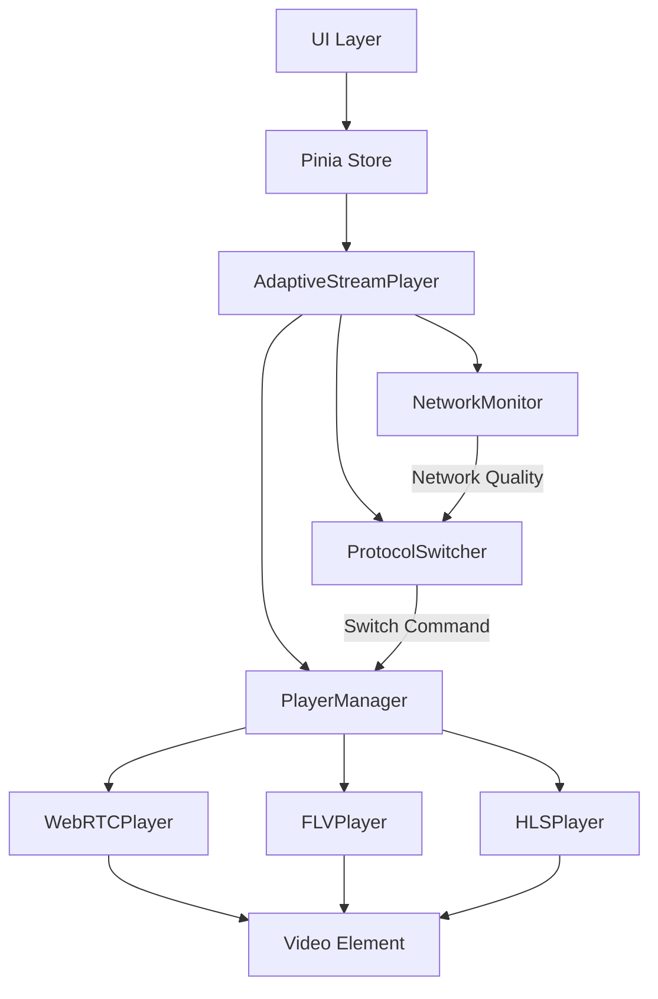
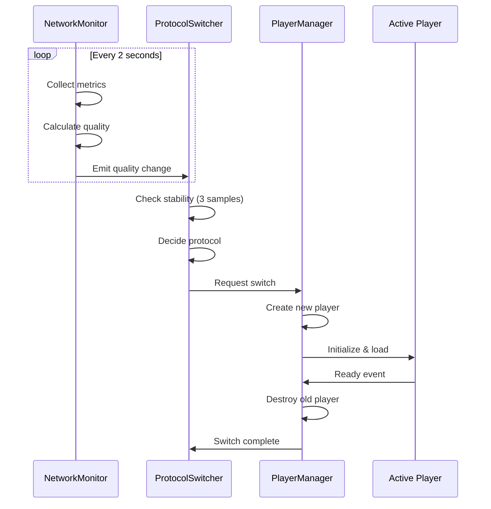

# 设计文档：多协议自适应拉流系统

## 概述

多协议自适应拉流系统是一个智能的视频流播放解决方案，能够根据实时网络状况在 WebRTC、FLV 和 HLS 三种流媒体协议之间自动切换。系统采用模块化架构，包含网络监测、协议切换决策、播放器管理三个核心模块，通过事件驱动的方式实现各模块间的解耦。

### 设计目标

1. **低延迟优先**：在网络条件允许的情况下，优先使用 WebRTC 协议以获得最低延迟
2. **无缝切换**：协议切换过程对用户透明，避免播放中断和黑屏
3. **智能决策**：基于多维度网络指标（RTT、丢包率、带宽）做出切换决策
4. **容错性强**：妥善处理各种异常情况，确保播放服务的可用性
5. **可配置性**：提供灵活的配置选项以适应不同场景需求

### 技术栈

- **Vue 3 + TypeScript**：前端框架和类型系统
- **Pinia**：状态管理
- **WebRTC API**：原生 WebRTC 支持
- **xgplayer-flv**：FLV 协议播放器
- **hls.js**：HLS 协议播放器
- **Navigator.connection API**：网络信息获取（降级方案：基于 RTT 估算）

## 架构

### 系统架构图



### 模块职责

1. **AdaptiveStreamPlayer**：主控制器，协调各模块工作
2. **NetworkMonitor**：网络状态监测，定期采集网络指标并计算网络质量等级
3. **ProtocolSwitcher**：协议切换决策器，根据网络质量决定何时切换协议
4. **PlayerManager**：播放器生命周期管理，负责创建、切换和销毁播放器实例
5. **WebRTCPlayer/FLVPlayer/HLSPlayer**：具体协议播放器的封装

### 数据流



## 组件和接口

### 1. NetworkMonitor（网络监测器）

**职责**：实时监测网络状态，计算网络质量等级

**接口**：

```typescript
interface NetworkMetrics {
  rtt: number;           // 往返时延（ms）
  packetLoss: number;    // 丢包率（0-1）
  bandwidth: number;     // 带宽（Mbps）
  timestamp: number;     // 采样时间戳
}

enum NetworkQuality {
  Good = 'good',
  Fair = 'fair',
  Poor = 'poor'
}

interface NetworkMonitorConfig {
  sampleInterval: number;        // 采样间隔（ms），默认 2000
  rttThresholds: {
    good: number;                // Good 阈值，默认 100ms
    poor: number;                // Poor 阈值，默认 300ms
  };
  packetLossThresholds: {
    good: number;                // Good 阈值，默认 0.01
    poor: number;                // Poor 阈值，默认 0.05
  };
  bandwidthThresholds: {
    good: number;                // Good 阈值，默认 2Mbps
    poor: number;                // Poor 阈值，默认 1Mbps
  };
}

class NetworkMonitor {
  constructor(config?: Partial<NetworkMonitorConfig>);
  
  start(): void;
  stop(): void;
  pause(): void;
  resume(): void;
  
  getCurrentMetrics(): NetworkMetrics;
  getCurrentQuality(): NetworkQuality;
  
  on(event: 'quality-change', handler: (quality: NetworkQuality) => void): void;
  on(event: 'metrics-update', handler: (metrics: NetworkMetrics) => void): void;
  off(event: string, handler: Function): void;
}
```

**实现细节**：

1. **网络指标采集**：
   - 优先使用 `navigator.connection` API 获取网络类型和有效带宽
   - 使用 `performance.getEntriesByType('resource')` 估算 RTT
   - 通过 WebRTC `RTCPeerConnection.getStats()` 获取丢包率（如果可用）
   - 降级方案：使用 Image 加载测试估算带宽和 RTT

2. **质量计算算法**：
   ```typescript
   function calculateQuality(metrics: NetworkMetrics): NetworkQuality {
     const { rtt, packetLoss, bandwidth } = metrics;
     
     // 任一指标达到 Poor 阈值，判定为 Poor
     if (rtt > 300 || packetLoss > 0.05 || bandwidth < 1) {
       return NetworkQuality.Poor;
     }
     
     // 所有指标达到 Good 阈值，判定为 Good
     if (rtt < 100 && packetLoss < 0.01 && bandwidth > 2) {
       return NetworkQuality.Good;
     }
     
     // 其他情况判定为 Fair
     return NetworkQuality.Fair;
   }
   ```

3. **采样频率调整**：
   - 播放中：每 2 秒采样一次
   - 暂停时：每 10 秒采样一次
   - 停止时：停止采样

### 2. ProtocolSwitcher（协议切换器）

**职责**：根据网络质量决定协议切换策略

**接口**：

```typescript
enum StreamProtocol {
  WebRTC = 'webrtc',
  FLV = 'flv',
  HLS = 'hls'
}

interface ProtocolSwitcherConfig {
  stabilityRequirement: number;  // 稳定性要求（连续采样次数），默认 3
  minSwitchInterval: number;     // 最小切换间隔（ms），默认 10000
  autoSwitch: boolean;           // 是否启用自动切换，默认 true
}

class ProtocolSwitcher {
  constructor(config?: Partial<ProtocolSwitcherConfig>);
  
  setNetworkQuality(quality: NetworkQuality): void;
  getCurrentProtocol(): StreamProtocol;
  setManualProtocol(protocol: StreamProtocol): void;
  enableAutoSwitch(): void;
  disableAutoSwitch(): void;
  isAutoSwitchEnabled(): boolean;
  
  on(event: 'switch-required', handler: (protocol: StreamProtocol) => void): void;
  off(event: string, handler: Function): void;
}
```

**实现细节**：

1. **协议优先级映射**：
   ```typescript
   const PROTOCOL_PRIORITY_MAP = {
     [NetworkQuality.Good]: StreamProtocol.WebRTC,
     [NetworkQuality.Fair]: StreamProtocol.FLV,
     [NetworkQuality.Poor]: StreamProtocol.HLS
   };
   ```

2. **稳定性检查**：
   - 维护一个长度为 N（默认 3）的质量历史队列
   - 只有当连续 N 次采样的质量等级一致时，才触发切换
   - 避免网络质量频繁波动导致的频繁切换

3. **切换频率限制**：
   - 记录上次切换时间戳
   - 两次切换之间至少间隔 10 秒（可配置）
   - 手动切换不受此限制

4. **手动模式**：
   - 手动模式下，停止监听网络质量变化
   - 直接切换到指定协议
   - 调用 `enableAutoSwitch()` 恢复自动模式

### 3. PlayerManager（播放器管理器）

**职责**：管理播放器实例的创建、切换和销毁

**接口**：

```typescript
interface PlayerConfig {
  streamUrls: {
    webrtc: string;
    flv: string;
    hls: string;
  };
  videoElement: HTMLVideoElement;
  srsHost: string;
  app: string;
  streamId: string;
}

interface PlayerState {
  protocol: StreamProtocol;
  status: 'idle' | 'loading' | 'playing' | 'paused' | 'error';
  error?: Error;
}

class PlayerManager {
  constructor(config: PlayerConfig);
  
  async switchProtocol(protocol: StreamProtocol): Promise<boolean>;
  async play(): Promise<void>;
  pause(): void;
  stop(): void;
  
  getState(): PlayerState;
  getCurrentProtocol(): StreamProtocol;
  
  on(event: 'state-change', handler: (state: PlayerState) => void): void;
  on(event: 'switch-complete', handler: (protocol: StreamProtocol) => void): void;
  on(event: 'switch-failed', handler: (error: Error) => void): void;
  off(event: string, handler: Function): void;
  
  destroy(): void;
}
```

**实现细节**：

1. **无缝切换流程**：
   ```typescript
   async switchProtocol(targetProtocol: StreamProtocol): Promise<boolean> {
     // 1. 如果已经是目标协议，直接返回
     if (this.currentProtocol === targetProtocol) return true;
     
     // 2. 记录当前播放时间（如果支持）
     const currentTime = this.getCurrentTime();
     
     // 3. 创建新播放器实例
     const newPlayer = this.createPlayer(targetProtocol);
     
     // 4. 初始化新播放器
     try {
       await newPlayer.initialize();
       await newPlayer.load();
       
       // 5. 尝试从记录的时间点继续播放（HLS 支持，WebRTC/FLV 直播流不支持）
       if (currentTime && targetProtocol === StreamProtocol.HLS) {
         newPlayer.seek(currentTime);
       }
       
       // 6. 等待新播放器稳定播放
       await this.waitForStablePlayback(newPlayer, 1000);
       
       // 7. 销毁旧播放器
       this.destroyCurrentPlayer();
       
       // 8. 更新当前播放器引用
       this.currentPlayer = newPlayer;
       this.currentProtocol = targetProtocol;
       
       return true;
     } catch (error) {
       // 切换失败，销毁新播放器，保持旧播放器
       newPlayer.destroy();
       throw error;
     }
   }
   ```

2. **播放器工厂**：
   ```typescript
   private createPlayer(protocol: StreamProtocol): BasePlayer {
     switch (protocol) {
       case StreamProtocol.WebRTC:
         return new WebRTCPlayer(this.config);
       case StreamProtocol.FLV:
         return new FLVPlayer(this.config);
       case StreamProtocol.HLS:
         return new HLSPlayer(this.config);
     }
   }
   ```

3. **资源清理**：
   - 销毁播放器时，调用其 `destroy()` 方法
   - 移除所有事件监听器
   - 清空 video 元素的 src
   - 释放媒体流资源

### 4. 具体播放器实现

#### BasePlayer（抽象基类）

```typescript
abstract class BasePlayer {
  protected config: PlayerConfig;
  protected videoElement: HTMLVideoElement;
  
  constructor(config: PlayerConfig) {
    this.config = config;
    this.videoElement = config.videoElement;
  }
  
  abstract async initialize(): Promise<void>;
  abstract async load(): Promise<void>;
  abstract async play(): Promise<void>;
  abstract pause(): void;
  abstract destroy(): void;
  
  getCurrentTime(): number {
    return this.videoElement.currentTime;
  }
  
  seek(time: number): void {
    this.videoElement.currentTime = time;
  }
}
```

#### WebRTCPlayer

```typescript
class WebRTCPlayer extends BasePlayer {
  private webrtcService: WebRTCService;
  
  async initialize(): Promise<void> {
    this.webrtcService = new WebRTCService(this.config.srsHost);
  }
  
  async load(): Promise<void> {
    const stream = await this.webrtcService.playFromSRS(
      this.config.app,
      this.config.streamId
    );
    
    if (!stream) {
      throw new Error('Failed to load WebRTC stream');
    }
    
    this.videoElement.srcObject = stream;
  }
  
  async play(): Promise<void> {
    await this.videoElement.play();
  }
  
  pause(): void {
    this.videoElement.pause();
  }
  
  destroy(): void {
    this.webrtcService.stop();
    this.videoElement.srcObject = null;
  }
}
```

#### FLVPlayer

```typescript
class FLVPlayer extends BasePlayer {
  private webrtcService: WebRTCService;
  
  async initialize(): Promise<void> {
    this.webrtcService = new WebRTCService(this.config.srsHost);
  }
  
  async load(): Promise<void> {
    const success = await this.webrtcService.playFLVSRS(
      this.config.app,
      this.config.streamId,
      this.videoElement,
      this.config.streamUrls.flv
    );
    
    if (!success) {
      throw new Error('Failed to load FLV stream');
    }
  }
  
  async play(): Promise<void> {
    await this.videoElement.play();
  }
  
  pause(): void {
    this.videoElement.pause();
  }
  
  destroy(): void {
    this.webrtcService.stopFlv();
  }
}
```

#### HLSPlayer

```typescript
import Hls from 'hls.js';

class HLSPlayer extends BasePlayer {
  private hls: Hls | null = null;
  
  async initialize(): Promise<void> {
    if (!Hls.isSupported()) {
      // 降级到原生 HLS 支持（Safari）
      if (this.videoElement.canPlayType('application/vnd.apple.mpegurl')) {
        return;
      }
      throw new Error('HLS is not supported');
    }
    
    this.hls = new Hls({
      lowLatencyMode: false,
      maxBufferLength: 30,
      maxMaxBufferLength: 60
    });
  }
  
  async load(): Promise<void> {
    if (this.hls) {
      this.hls.loadSource(this.config.streamUrls.hls);
      this.hls.attachMedia(this.videoElement);
      
      return new Promise((resolve, reject) => {
        this.hls!.on(Hls.Events.MANIFEST_PARSED, () => resolve());
        this.hls!.on(Hls.Events.ERROR, (event, data) => {
          if (data.fatal) reject(new Error(data.details));
        });
      });
    } else {
      // 原生 HLS 支持
      this.videoElement.src = this.config.streamUrls.hls;
      return new Promise((resolve, reject) => {
        this.videoElement.onloadedmetadata = () => resolve();
        this.videoElement.onerror = () => reject(new Error('HLS load failed'));
      });
    }
  }
  
  async play(): Promise<void> {
    await this.videoElement.play();
  }
  
  pause(): void {
    this.videoElement.pause();
  }
  
  destroy(): void {
    if (this.hls) {
      this.hls.destroy();
      this.hls = null;
    }
    this.videoElement.src = '';
  }
}
```

### 5. AdaptiveStreamPlayer（主控制器）

**职责**：协调各模块，提供统一的对外接口

**接口**：

```typescript
interface AdaptiveStreamPlayerConfig {
  videoElement: HTMLVideoElement;
  srsHost: string;
  app: string;
  streamId: string;
  networkMonitor?: Partial<NetworkMonitorConfig>;
  protocolSwitcher?: Partial<ProtocolSwitcherConfig>;
}

class AdaptiveStreamPlayer {
  constructor(config: AdaptiveStreamPlayerConfig);
  
  async start(): Promise<void>;
  stop(): void;
  pause(): void;
  resume(): void;
  
  setManualProtocol(protocol: StreamProtocol): void;
  enableAutoSwitch(): void;
  
  getState(): {
    protocol: StreamProtocol;
    networkQuality: NetworkQuality;
    isAutoSwitch: boolean;
    playerState: PlayerState;
  };
  
  on(event: string, handler: Function): void;
  off(event: string, handler: Function): void;
  
  destroy(): void;
}
```

**实现细节**：

```typescript
class AdaptiveStreamPlayer {
  private networkMonitor: NetworkMonitor;
  private protocolSwitcher: ProtocolSwitcher;
  private playerManager: PlayerManager;
  
  constructor(config: AdaptiveStreamPlayerConfig) {
    // 初始化各模块
    this.networkMonitor = new NetworkMonitor(config.networkMonitor);
    this.protocolSwitcher = new ProtocolSwitcher(config.protocolSwitcher);
    
    // 构建流 URL
    const streamUrls = {
      webrtc: `webrtc://${config.srsHost}/${config.app}/${config.streamId}`,
      flv: `http://${config.srsHost}/${config.app}/${config.streamId}.flv`,
      hls: `http://${config.srsHost}/${config.app}/${config.streamId}.m3u8`
    };
    
    this.playerManager = new PlayerManager({
      streamUrls,
      videoElement: config.videoElement,
      srsHost: config.srsHost,
      app: config.app,
      streamId: config.streamId
    });
    
    // 连接各模块
    this.setupEventHandlers();
  }
  
  private setupEventHandlers(): void {
    // 网络质量变化 -> 协议切换器
    this.networkMonitor.on('quality-change', (quality) => {
      this.protocolSwitcher.setNetworkQuality(quality);
    });
    
    // 协议切换需求 -> 播放器管理器
    this.protocolSwitcher.on('switch-required', async (protocol) => {
      try {
        await this.playerManager.switchProtocol(protocol);
      } catch (error) {
        console.error('Protocol switch failed:', error);
        // 尝试降级到下一个协议
        await this.fallbackToNextProtocol(protocol);
      }
    });
  }
  
  private async fallbackToNextProtocol(failedProtocol: StreamProtocol): Promise<void> {
    const fallbackOrder = {
      [StreamProtocol.WebRTC]: StreamProtocol.FLV,
      [StreamProtocol.FLV]: StreamProtocol.HLS,
      [StreamProtocol.HLS]: null
    };
    
    const nextProtocol = fallbackOrder[failedProtocol];
    if (nextProtocol) {
      await this.playerManager.switchProtocol(nextProtocol);
    }
  }
  
  async start(): Promise<void> {
    // 启动网络监测
    this.networkMonitor.start();
    
    // 获取初始网络质量
    const initialQuality = this.networkMonitor.getCurrentQuality();
    this.protocolSwitcher.setNetworkQuality(initialQuality);
    
    // 根据初始质量选择协议并开始播放
    const initialProtocol = this.protocolSwitcher.getCurrentProtocol();
    await this.playerManager.switchProtocol(initialProtocol);
    await this.playerManager.play();
  }
  
  stop(): void {
    this.networkMonitor.stop();
    this.playerManager.stop();
  }
  
  destroy(): void {
    this.networkMonitor.stop();
    this.playerManager.destroy();
  }
}
```

## 数据模型

### 状态管理（Pinia Store）

```typescript
import { defineStore } from 'pinia';

export const useStreamStore = defineStore('stream', {
  state: () => ({
    // 播放器状态
    protocol: StreamProtocol.WebRTC as StreamProtocol,
    playerStatus: 'idle' as 'idle' | 'loading' | 'playing' | 'paused' | 'error',
    
    // 网络状态
    networkQuality: NetworkQuality.Fair as NetworkQuality,
    networkMetrics: null as NetworkMetrics | null,
    
    // 控制状态
    isAutoSwitch: true,
    isManualMode: false,
    
    // 配置
    config: {
      srsHost: 'http://101.35.16.42:1985',
      app: 'live',
      streamId: 'stream1'
    },
    
    // 错误信息
    error: null as Error | null
  }),
  
  getters: {
    isPlaying: (state) => state.playerStatus === 'playing',
    hasError: (state) => state.error !== null,
    protocolDisplayName: (state) => {
      const names = {
        [StreamProtocol.WebRTC]: 'WebRTC (低延迟)',
        [StreamProtocol.FLV]: 'FLV (中延迟)',
        [StreamProtocol.HLS]: 'HLS (高延迟)'
      };
      return names[state.protocol];
    }
  },
  
  actions: {
    updateProtocol(protocol: StreamProtocol) {
      this.protocol = protocol;
    },
    
    updatePlayerStatus(status: typeof this.playerStatus) {
      this.playerStatus = status;
    },
    
    updateNetworkQuality(quality: NetworkQuality) {
      this.networkQuality = quality;
    },
    
    updateNetworkMetrics(metrics: NetworkMetrics) {
      this.networkMetrics = metrics;
    },
    
    setManualMode(enabled: boolean) {
      this.isManualMode = enabled;
      this.isAutoSwitch = !enabled;
    },
    
    setError(error: Error | null) {
      this.error = error;
      if (error) {
        this.playerStatus = 'error';
      }
    }
  }
});
```

### URL 生成工具

```typescript
interface StreamUrlConfig {
  srsHost: string;
  app: string;
  streamId: string;
}

class StreamUrlGenerator {
  static generate(config: StreamUrlConfig): Record<StreamProtocol, string> {
    const { srsHost, app, streamId } = config;
    const host = srsHost.replace(/^https?:\/\//, '').replace(/:\d+$/, '');
    
    return {
      [StreamProtocol.WebRTC]: `webrtc://${host}/${app}/${streamId}`,
      [StreamProtocol.FLV]: `${srsHost}/${app}/${streamId}.flv`,
      [StreamProtocol.HLS]: `${srsHost}/${app}/${streamId}.m3u8`
    };
  }
}
```


## 正确性属性

属性是一种特征或行为，应该在系统的所有有效执行中保持为真——本质上是关于系统应该做什么的形式化陈述。属性是人类可读规范和机器可验证正确性保证之间的桥梁。

### 属性反思与去重

在分析了所有验收标准后，我识别出以下冗余模式并进行了合并：

1. **网络质量判定属性（1.5, 1.6, 1.7）** 可以合并为一个综合属性，测试质量计算函数的正确性
2. **协议优先级配置（2.1, 2.2, 2.3）** 可以合并为一个属性，测试优先级映射的完整性
3. **URL 格式生成（2.5, 2.6, 2.7）** 可以合并为一个属性，测试所有协议的 URL 格式
4. **协议切换决策（3.1, 3.2, 3.3）** 可以合并为一个属性，测试质量到协议的映射
5. **状态维护属性（8.1, 8.2, 8.3, 8.4）** 可以合并为一个属性，测试状态查询的完整性
6. **事件通知属性（8.5, 8.6, 8.7）** 可以合并为一个属性，测试所有状态变化都触发事件
7. **配置能力属性（10.1-10.6）** 可以合并为一个属性，测试所有配置项都可以自定义

### 核心正确性属性

#### 属性 1：网络质量计算正确性

*对于任意* 网络指标（RTT、丢包率、带宽），质量计算函数应该根据阈值正确分类为 Good、Fair 或 Poor，且输出必须是这三个值之一。

**验证：需求 1.4, 1.5, 1.6, 1.7**

#### 属性 2：质量变化触发通知

*对于任意* 网络质量变化，Network_Monitor 应该触发 quality-change 事件，且事件携带的质量值应该与当前质量一致。

**验证：需求 1.8**

#### 属性 3：协议优先级映射完整性

*对于任意* 网络质量等级（Good/Fair/Poor），系统应该能映射到唯一的协议（WebRTC/FLV/HLS），且映射关系为：Good→WebRTC, Fair→FLV, Poor→HLS。

**验证：需求 2.1, 2.2, 2.3, 3.1, 3.2, 3.3**

#### 属性 4：流 URL 格式正确性

*对于任意* 流配置（srsHost、app、streamId）和协议类型，生成的 URL 应该符合对应协议的格式规范：WebRTC 以 `webrtc://` 开头，FLV 以 `.flv` 结尾，HLS 以 `.m3u8` 结尾。

**验证：需求 2.4, 2.5, 2.6, 2.7**

#### 属性 5：稳定性检查防抖动

*对于任意* 网络质量变化序列，只有当连续 N 次（默认 3 次）采样的质量等级相同时，才应该触发协议切换决策。

**验证：需求 3.4, 9.5**

#### 属性 6：协议切换频率限制

*对于任意* 时间窗口，在最小切换间隔（默认 10 秒）内，系统不应该执行多次协议切换（手动切换除外）。

**验证：需求 9.4**

#### 属性 7：切换失败降级链

*对于任意* 协议切换失败，系统应该按照优先级降级链（WebRTC→FLV→HLS）尝试下一个协议，直到成功或所有协议都失败。

**验证：需求 3.6, 7.1, 7.4**

#### 属性 8：播放器互斥性

*对于任意* 时刻，Player_Manager 应该确保最多只有一个播放器实例处于活动状态（正在播放或已加载）。

**验证：需求 6.2**

#### 属性 9：播放器类型正确性

*对于任意* 协议类型，Player_Manager 创建的播放器实例应该与协议类型匹配：WebRTC→WebRTCPlayer, FLV→FLVPlayer, HLS→HLSPlayer。

**验证：需求 6.1, 6.3**

#### 属性 10：资源清理完整性

*对于任意* 播放器销毁操作，系统应该释放所有相关资源：移除事件监听器、清空 video 元素、释放媒体流、销毁播放器实例。

**验证：需求 6.4, 6.5, 6.6**

#### 属性 11：手动模式禁用自动切换

*对于任意* 网络质量变化，当系统处于手动模式时，不应该触发自动协议切换。

**验证：需求 5.3**

#### 属性 12：手动切换立即执行

*对于任意* 手动协议选择，系统应该立即执行切换，不受稳定性检查和切换间隔限制。

**验证：需求 5.2**

#### 属性 13：自动模式恢复切换

*对于任意* 网络质量变化，当从手动模式切换回自动模式后，系统应该恢复根据网络质量自动切换协议。

**验证：需求 5.4**

#### 属性 14：状态查询一致性

*对于任意* 时刻，系统提供的状态查询接口应该返回当前的协议、网络质量、手动模式标志和播放状态，且这些状态应该与内部状态一致。

**验证：需求 8.1, 8.2, 8.3, 8.4, 8.8**

#### 属性 15：状态变化事件完整性

*对于任意* 状态变化（协议、网络质量、播放状态），系统应该触发对应的事件，且事件携带的数据应该与新状态一致。

**验证：需求 8.5, 8.6, 8.7**

#### 属性 16：错误信息非空性

*对于任意* 错误情况（初始化失败、播放错误、URL 不可用等），系统记录的错误信息应该是非空字符串，且包含错误类型描述。

**验证：需求 7.2, 7.7**

#### 属性 17：网络监测失败降级

*对于任意* 网络监测失败情况，系统应该使用默认的网络质量值（Fair），并继续正常运行。

**验证：需求 7.5**

#### 属性 18：采样频率自适应

*对于任意* 播放状态变化，网络监测的采样间隔应该自适应调整：播放中为 2 秒，暂停时为 10 秒，停止时为 0（停止监测）。

**验证：需求 9.1, 9.2**

#### 属性 19：DOM 元素复用

*对于任意* 协议切换操作，Player_Manager 应该复用同一个 video DOM 元素，而不是创建新元素。

**验证：需求 9.3**

#### 属性 20：配置项可定制性

*对于任意* 配置项（阈值、采样间隔、稳定性要求、最小切换间隔、自动切换开关、URL 模板），系统应该接受自定义值并在运行时使用这些值。

**验证：需求 10.1, 10.2, 10.3, 10.4, 10.5, 10.6**

## 错误处理

### 错误分类

1. **网络错误**：
   - 网络监测失败：使用默认质量值（Fair）
   - 网络断开：保持当前播放器，等待恢复
   - 网络波动：通过稳定性检查避免频繁切换

2. **播放器错误**：
   - 初始化失败：降级到下一个协议
   - 加载失败：降级到下一个协议
   - 播放中断：尝试重连当前协议，失败后降级
   - 所有协议都失败：保持当前状态，通知用户

3. **配置错误**：
   - 无效的流 URL：通知用户，停止播放
   - 无效的配置参数：使用默认值，记录警告

4. **资源错误**：
   - Video 元素不可用：抛出错误，停止初始化
   - 播放器库加载失败：降级到其他协议

### 错误恢复策略

```typescript
class ErrorRecoveryStrategy {
  // 可恢复错误：网络临时中断、缓冲超时
  static isRecoverable(error: Error): boolean {
    const recoverablePatterns = [
      /network.*timeout/i,
      /buffer.*underrun/i,
      /temporary.*failure/i
    ];
    return recoverablePatterns.some(pattern => pattern.test(error.message));
  }
  
  // 降级策略
  static getNextProtocol(current: StreamProtocol): StreamProtocol | null {
    const fallbackChain = {
      [StreamProtocol.WebRTC]: StreamProtocol.FLV,
      [StreamProtocol.FLV]: StreamProtocol.HLS,
      [StreamProtocol.HLS]: null
    };
    return fallbackChain[current];
  }
  
  // 重试策略
  static getRetryConfig(errorCount: number): { shouldRetry: boolean; delay: number } {
    if (errorCount >= 3) {
      return { shouldRetry: false, delay: 0 };
    }
    return {
      shouldRetry: true,
      delay: Math.min(1000 * Math.pow(2, errorCount), 5000) // 指数退避，最大 5 秒
    };
  }
}
```

### 错误通知

所有错误都应该通过事件系统通知：

```typescript
interface ErrorEvent {
  type: 'network' | 'player' | 'config' | 'resource';
  severity: 'warning' | 'error' | 'fatal';
  message: string;
  error: Error;
  context: {
    protocol?: StreamProtocol;
    networkQuality?: NetworkQuality;
    timestamp: number;
  };
}

// 使用示例
player.on('error', (event: ErrorEvent) => {
  console.error(`[${event.severity}] ${event.type}: ${event.message}`);
  
  if (event.severity === 'fatal') {
    // 显示用户友好的错误提示
    showErrorNotification('播放失败，请稍后重试');
  }
});
```

## 测试策略

### 双重测试方法

本系统采用单元测试和基于属性的测试（Property-Based Testing, PBT）相结合的方法：

- **单元测试**：验证特定示例、边缘情况和错误条件
- **属性测试**：验证跨所有输入的通用属性

两者互补且都是必需的，以实现全面覆盖。单元测试捕获具体的 bug，属性测试验证一般正确性。

### 单元测试策略

单元测试应该专注于：

1. **具体示例**：
   - 测试特定网络指标组合的质量判定
   - 测试特定协议切换场景
   - 测试特定错误情况的处理

2. **边缘情况**：
   - 阈值边界值测试（RTT = 100ms, 300ms）
   - 空值和 null 处理
   - 极端网络条件（RTT = 0, 丢包率 = 100%）

3. **集成点**：
   - 模块间事件传递
   - 播放器与 video 元素的交互
   - Pinia store 的状态更新

4. **错误条件**：
   - 播放器初始化失败
   - 网络监测 API 不可用
   - 所有协议都失败的情况

### 基于属性的测试策略

**测试库选择**：使用 **fast-check**（TypeScript/JavaScript 的 PBT 库）

**配置要求**：
- 每个属性测试至少运行 100 次迭代
- 每个测试必须引用设计文档中的属性
- 标签格式：`Feature: adaptive-stream-protocol, Property {number}: {property_text}`

**属性测试实现示例**：

```typescript
import fc from 'fast-check';

describe('Property Tests - adaptive-stream-protocol', () => {
  // Feature: adaptive-stream-protocol, Property 1: 网络质量计算正确性
  it('should correctly classify network quality for any metrics', () => {
    fc.assert(
      fc.property(
        fc.record({
          rtt: fc.nat(1000),
          packetLoss: fc.float({ min: 0, max: 1 }),
          bandwidth: fc.float({ min: 0, max: 10 })
        }),
        (metrics) => {
          const quality = calculateQuality(metrics);
          
          // 输出必须是三个值之一
          expect(['good', 'fair', 'poor']).toContain(quality);
          
          // 验证分类逻辑
          if (metrics.rtt > 300 || metrics.packetLoss > 0.05 || metrics.bandwidth < 1) {
            expect(quality).toBe('poor');
          } else if (metrics.rtt < 100 && metrics.packetLoss < 0.01 && metrics.bandwidth > 2) {
            expect(quality).toBe('good');
          } else {
            expect(quality).toBe('fair');
          }
        }
      ),
      { numRuns: 100 }
    );
  });
  
  // Feature: adaptive-stream-protocol, Property 4: 流 URL 格式正确性
  it('should generate correct URL format for any stream config and protocol', () => {
    fc.assert(
      fc.property(
        fc.record({
          srsHost: fc.webUrl(),
          app: fc.stringOf(fc.char(), { minLength: 1, maxLength: 20 }),
          streamId: fc.stringOf(fc.char(), { minLength: 1, maxLength: 20 })
        }),
        fc.constantFrom('webrtc', 'flv', 'hls'),
        (config, protocol) => {
          const url = generateStreamUrl(config, protocol);
          
          switch (protocol) {
            case 'webrtc':
              expect(url).toMatch(/^webrtc:\/\//);
              break;
            case 'flv':
              expect(url).toMatch(/\.flv$/);
              expect(url).toMatch(/^https?:\/\//);
              break;
            case 'hls':
              expect(url).toMatch(/\.m3u8$/);
              expect(url).toMatch(/^https?:\/\//);
              break;
          }
        }
      ),
      { numRuns: 100 }
    );
  });
  
  // Feature: adaptive-stream-protocol, Property 8: 播放器互斥性
  it('should ensure only one player is active at any time', () => {
    fc.assert(
      fc.property(
        fc.array(fc.constantFrom('webrtc', 'flv', 'hls'), { minLength: 2, maxLength: 10 }),
        async (protocolSequence) => {
          const manager = new PlayerManager(testConfig);
          
          for (const protocol of protocolSequence) {
            await manager.switchProtocol(protocol);
            
            // 验证只有一个活动播放器
            const activePlayers = manager.getActivePlayers();
            expect(activePlayers.length).toBe(1);
            expect(activePlayers[0].protocol).toBe(protocol);
          }
          
          manager.destroy();
        }
      ),
      { numRuns: 100 }
    );
  });
});
```

### 测试覆盖目标

- **代码覆盖率**：至少 80%
- **属性覆盖率**：所有 20 个正确性属性都有对应的属性测试
- **需求覆盖率**：所有可测试的验收标准都有对应的测试

### 测试环境

- **单元测试**：Vitest
- **属性测试**：fast-check
- **E2E 测试**：Playwright（可选，用于真实浏览器环境测试）
- **Mock 工具**：vi.mock（Vitest 内置）

### 持续集成

所有测试应该在 CI/CD 流程中自动运行：

```yaml
# .github/workflows/test.yml
name: Test
on: [push, pull_request]
jobs:
  test:
    runs-on: ubuntu-latest
    steps:
      - uses: actions/checkout@v3
      - uses: actions/setup-node@v3
        with:
          node-version: '18'
      - run: npm install
      - run: npm run test:unit
      - run: npm run test:property
      - run: npm run test:coverage
```

## 实现注意事项

### 性能考虑

1. **网络监测优化**：
   - 使用 Web Worker 进行网络监测，避免阻塞主线程
   - 缓存网络指标，避免重复计算
   - 使用节流（throttle）限制事件触发频率

2. **播放器切换优化**：
   - 预加载下一个可能的协议播放器
   - 使用 requestIdleCallback 在空闲时进行资源清理
   - 避免在切换过程中进行重量级操作

3. **内存管理**：
   - 及时释放不再使用的播放器实例
   - 使用 WeakMap 存储临时数据
   - 定期清理事件监听器

### 浏览器兼容性

1. **Navigator.connection API**：
   - Chrome/Edge: 完全支持
   - Firefox: 部分支持
   - Safari: 不支持
   - 降级方案：使用 RTT 估算和资源加载测试

2. **WebRTC**：
   - 所有现代浏览器都支持
   - 需要 HTTPS 或 localhost

3. **HLS.js**：
   - 所有现代浏览器都支持
   - Safari 原生支持 HLS，可以不使用 hls.js

### 安全考虑

1. **URL 验证**：
   - 验证流 URL 的格式和来源
   - 防止 XSS 攻击

2. **CORS 配置**：
   - 确保 SRS 服务器正确配置 CORS 头
   - 处理跨域请求失败的情况

3. **资源限制**：
   - 限制重试次数，避免无限重试
   - 限制并发连接数

### Vue 3 集成

```vue
<template>
  <div class="adaptive-player">
    <video ref="videoRef" class="video-player"></video>
    
    <div class="player-controls">
      <div class="status">
        <span>协议: {{ store.protocolDisplayName }}</span>
        <span>网络: {{ store.networkQuality }}</span>
        <span :class="{ manual: store.isManualMode }">
          {{ store.isManualMode ? '手动' : '自动' }}
        </span>
      </div>
      
      <div class="manual-controls" v-if="store.isManualMode">
        <button @click="switchProtocol('webrtc')">WebRTC</button>
        <button @click="switchProtocol('flv')">FLV</button>
        <button @click="switchProtocol('hls')">HLS</button>
      </div>
      
      <button @click="toggleAutoSwitch">
        {{ store.isAutoSwitch ? '切换到手动' : '切换到自动' }}
      </button>
    </div>
  </div>
</template>

<script setup lang="ts">
import { ref, onMounted, onUnmounted } from 'vue';
import { useStreamStore } from '@/stores/stream';
import { AdaptiveStreamPlayer } from '@/services/AdaptiveStreamPlayer';

const store = useStreamStore();
const videoRef = ref<HTMLVideoElement>();
let player: AdaptiveStreamPlayer | null = null;

onMounted(async () => {
  if (!videoRef.value) return;
  
  player = new AdaptiveStreamPlayer({
    videoElement: videoRef.value,
    srsHost: store.config.srsHost,
    app: store.config.app,
    streamId: store.config.streamId
  });
  
  // 同步状态到 store
  player.on('protocol-change', (protocol) => {
    store.updateProtocol(protocol);
  });
  
  player.on('network-quality-change', (quality) => {
    store.updateNetworkQuality(quality);
  });
  
  player.on('error', (error) => {
    store.setError(error);
  });
  
  await player.start();
});

onUnmounted(() => {
  player?.destroy();
});

function switchProtocol(protocol: string) {
  player?.setManualProtocol(protocol as any);
}

function toggleAutoSwitch() {
  if (store.isAutoSwitch) {
    store.setManualMode(true);
  } else {
    player?.enableAutoSwitch();
    store.setManualMode(false);
  }
}
</script>
```

## 未来扩展

1. **支持更多协议**：
   - DASH（Dynamic Adaptive Streaming over HTTP）
   - SRT（Secure Reliable Transport）
   - RTSP（Real Time Streaming Protocol）

2. **智能预测**：
   - 使用机器学习预测网络质量趋势
   - 提前切换协议，减少切换延迟

3. **多流支持**：
   - 同时播放多个流
   - 流之间的同步

4. **高级分析**：
   - 播放质量指标（QoE）
   - 用户行为分析
   - 性能监控和告警
