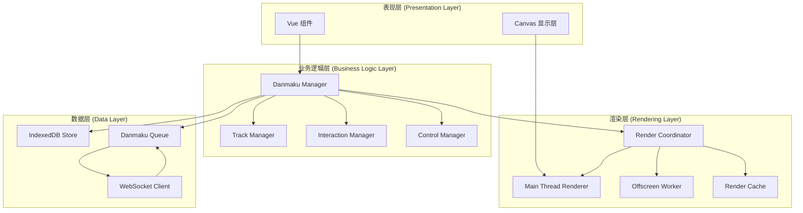
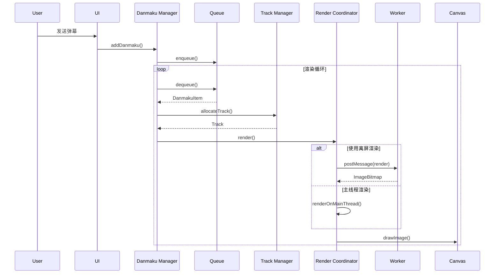

# 设计文档：高性能弹幕系统

## 概述

高性能弹幕系统是一个基于 Canvas 和 Web Worker 的实时弹幕渲染引擎，支持每秒千条级别的弹幕流畅展示。系统采用离屏渲染、预渲染缓存和虚拟轨道技术，确保在高并发场景下保持 60fps 的流畅度。

核心技术特点：
- 使用 OffscreenCanvas 在 Worker 线程中渲染，避免阻塞主线程
- LRU 缓存策略预渲染弹幕纹理，减少重复渲染开销
- 虚拟轨道系统智能分配弹幕位置，避免重叠
- 优先级队列和限流机制处理高并发弹幕流
- WebSocket 实时通信 + IndexedDB 历史存储

## 架构

系统采用分层架构，分为以下几个主要层次：

### 架构图



### 层次说明

1. **表现层**：负责用户界面和 Canvas 显示
   - Vue 组件：控制面板、交互菜单、设置界面
   - Canvas 显示层：最终的弹幕渲染输出

2. **业务逻辑层**：核心业务逻辑
   - Danmaku Manager：弹幕生命周期管理
   - Track Manager：轨道分配和碰撞检测
   - Interaction Manager：用户交互处理
   - Control Manager：弹幕控制设置

3. **渲染层**：高性能渲染引擎
   - Render Coordinator：协调主线程和 Worker 渲染
   - Main Thread Renderer：主线程渲染器
   - Offscreen Worker：离屏渲染工作线程
   - Render Cache：LRU 渲染缓存

4. **数据层**：数据通信和存储
   - WebSocket Client：实时通信
   - IndexedDB Store：历史数据持久化
   - Danmaku Queue：弹幕缓冲队列

## 组件和接口

### 1. Danmaku Manager

弹幕管理器是系统的核心协调者，负责弹幕的完整生命周期。

```typescript
interface DanmakuManager {
  // 初始化系统
  initialize(canvas: HTMLCanvasElement, config: DanmakuConfig): void
  
  // 添加弹幕到队列
  addDanmaku(danmaku: DanmakuItem): void
  
  // 启动渲染循环
  start(): void
  
  // 停止渲染循环
  stop(): void
  
  // 更新弹幕状态（每帧调用）
  update(deltaTime: number): void
  
  // 清除所有弹幕
  clear(): void
  
  // 获取当前活动弹幕数量
  getActiveDanmakuCount(): number
}

interface DanmakuItem {
  id: string                    // 唯一标识符
  text: string                  // 弹幕文本
  type: DanmakuType            // 弹幕类型
  color: string                 // 颜色（RGB 或十六进制）
  size: DanmakuSize            // 字体大小
  priority: number              // 优先级（0-10）
  userId: string                // 发送者 ID
  timestamp: number             // 发送时间戳
  speed?: number                // 自定义速度
  position?: { x: number, y: number }  // 固定位置（顶部/底部弹幕）
}

enum DanmakuType {
  SCROLL = 'scroll',           // 滚动弹幕
  TOP = 'top',                 // 顶部弹幕
  BOTTOM = 'bottom',           // 底部弹幕
  VIP = 'vip',                 // VIP 弹幕
  GIFT = 'gift'                // 礼物弹幕
}

enum DanmakuSize {
  SMALL = 18,
  MEDIUM = 24,
  LARGE = 32
}

interface DanmakuConfig {
  width: number                 // Canvas 宽度
  height: number                // Canvas 高度
  maxDanmaku: number           // 最大同时显示弹幕数
  trackHeight: number          // 轨道高度
  trackGap: number             // 轨道间距
  useOffscreen: boolean        // 是否使用离屏渲染
  cacheSize: number            // 缓存大小（MB）
}
```

### 2. Track Manager

轨道管理器负责虚拟轨道的分配、碰撞检测和释放。

```typescript
interface TrackManager {
  // 初始化轨道
  initialize(canvasHeight: number, trackHeight: number, trackGap: number): void
  
  // 分配轨道
  allocateTrack(danmaku: DanmakuItem): Track | null
  
  // 释放轨道
  releaseTrack(trackId: number): void
  
  // 检查碰撞
  checkCollision(track: Track, danmaku: DanmakuItem): boolean
  
  // 获取可用轨道数量
  getAvailableTrackCount(): number
}

interface Track {
  id: number                    // 轨道 ID
  y: number                     // Y 坐标
  type: TrackType              // 轨道类型
  occupied: boolean            // 是否被占用
  lastDanmaku: DanmakuItem | null  // 最后一条弹幕
  lastDanmakuEndTime: number   // 最后一条弹幕的结束时间
}

enum TrackType {
  SCROLL = 'scroll',
  TOP = 'top',
  BOTTOM = 'bottom'
}
```

### 3. Render Coordinator

渲染协调器负责协调主线程和 Worker 线程的渲染工作。

```typescript
interface RenderCoordinator {
  // 初始化渲染器
  initialize(canvas: HTMLCanvasElement, useOffscreen: boolean): void
  
  // 渲染弹幕列表
  render(danmakuList: ActiveDanmaku[]): void
  
  // 清空画布
  clear(): void
  
  // 销毁渲染器
  destroy(): void
}

interface ActiveDanmaku extends DanmakuItem {
  x: number                     // 当前 X 坐标
  y: number                     // 当前 Y 坐标
  track: Track                  // 所在轨道
  startTime: number             // 开始显示时间
  duration: number              // 显示时长
  texture?: ImageBitmap         // 预渲染纹理
}
```

### 4. Offscreen Worker

离屏渲染工作线程在 Web Worker 中执行渲染任务。

```typescript
// Worker 消息接口
interface WorkerMessage {
  type: 'render' | 'cache' | 'clear'
  payload: any
}

interface RenderPayload {
  danmakuList: ActiveDanmaku[]
  canvasWidth: number
  canvasHeight: number
}

interface CachePayload {
  danmaku: DanmakuItem
}

// Worker 响应接口
interface WorkerResponse {
  type: 'rendered' | 'cached' | 'error'
  payload: any
}

interface RenderedPayload {
  imageBitmap: ImageBitmap
  transferables: Transferable[]
}
```

### 5. Render Cache

LRU 缓存管理器，存储预渲染的弹幕纹理。

```typescript
interface RenderCache {
  // 获取缓存
  get(key: string): ImageBitmap | null
  
  // 设置缓存
  set(key: string, texture: ImageBitmap): void
  
  // 生成缓存键
  generateKey(danmaku: DanmakuItem): string
  
  // 清空缓存
  clear(): void
  
  // 获取缓存大小
  getSize(): number
  
  // 获取缓存命中率
  getHitRate(): number
}

interface CacheEntry {
  key: string
  texture: ImageBitmap
  size: number                  // 字节大小
  lastAccessed: number          // 最后访问时间
  accessCount: number           // 访问次数
}
```

### 6. Danmaku Queue

弹幕队列负责缓冲和平滑释放弹幕。

```typescript
interface DanmakuQueue {
  // 入队
  enqueue(danmaku: DanmakuItem): void
  
  // 出队
  dequeue(): DanmakuItem | null
  
  // 批量出队
  dequeueBatch(count: number): DanmakuItem[]
  
  // 获取队列长度
  getLength(): number
  
  // 清空队列
  clear(): void
  
  // 检查是否为空
  isEmpty(): boolean
}

// 优先级队列实现
class PriorityQueue implements DanmakuQueue {
  private queues: Map<number, DanmakuItem[]>  // 按优先级分组
  private maxSize: number = 5000
  
  enqueue(danmaku: DanmakuItem): void {
    // 按优先级插入
  }
  
  dequeue(): DanmakuItem | null {
    // 优先级高的先出队
  }
}
```

### 7. WebSocket Client

WebSocket 客户端负责实时通信。

```typescript
interface WebSocketClient {
  // 连接服务器
  connect(url: string): Promise<void>
  
  // 断开连接
  disconnect(): void
  
  // 发送弹幕
  sendDanmaku(danmaku: DanmakuItem): void
  
  // 监听弹幕消息
  onDanmaku(callback: (danmaku: DanmakuItem) => void): void
  
  // 监听连接状态
  onConnectionChange(callback: (connected: boolean) => void): void
  
  // 重连
  reconnect(): Promise<void>
}

interface WebSocketMessage {
  type: 'danmaku' | 'like' | 'comment' | 'report'
  payload: any
  timestamp: number
}
```

### 8. IndexedDB Store

IndexedDB 存储负责历史弹幕持久化。

```typescript
interface IndexedDBStore {
  // 初始化数据库
  initialize(): Promise<void>
  
  // 保存弹幕
  saveDanmaku(danmaku: DanmakuItem): Promise<void>
  
  // 批量保存
  saveBatch(danmakuList: DanmakuItem[]): Promise<void>
  
  // 查询弹幕
  queryDanmaku(startTime: number, endTime: number): Promise<DanmakuItem[]>
  
  // 删除过期弹幕
  deleteExpired(beforeTime: number): Promise<void>
  
  // 清空数据库
  clear(): Promise<void>
}

interface DanmakuRecord extends DanmakuItem {
  savedAt: number               // 保存时间
}
```

### 9. Interaction Manager

交互管理器处理用户与弹幕的交互。

```typescript
interface InteractionManager {
  // 初始化交互
  initialize(canvas: HTMLCanvasElement): void
  
  // 处理点击事件
  handleClick(x: number, y: number): void
  
  // 显示交互菜单
  showMenu(danmaku: ActiveDanmaku, x: number, y: number): void
  
  // 点赞弹幕
  likeDanmaku(danmakuId: string): void
  
  // 评论弹幕
  commentDanmaku(danmakuId: string): void
  
  // 屏蔽用户
  blockUser(userId: string): void
  
  // 举报弹幕
  reportDanmaku(danmakuId: string, reason: string): void
}

interface InteractionMenu {
  danmaku: ActiveDanmaku
  position: { x: number, y: number }
  visible: boolean
  actions: InteractionAction[]
}

interface InteractionAction {
  type: 'like' | 'comment' | 'mention' | 'block' | 'report'
  label: string
  icon: string
  handler: () => void
}
```

### 10. Control Manager

控制管理器处理弹幕显示设置。

```typescript
interface ControlManager {
  // 设置弹幕可见性
  setVisible(visible: boolean): void
  
  // 设置透明度
  setOpacity(opacity: number): void
  
  // 设置速度
  setSpeed(speed: SpeedLevel): void
  
  // 设置密度
  setDensity(density: DensityLevel): void
  
  // 添加关键词过滤
  addKeywordFilter(keyword: string): void
  
  // 移除关键词过滤
  removeKeywordFilter(keyword: string): void
  
  // 添加用户过滤
  addUserFilter(userId: string): void
  
  // 获取当前设置
  getSettings(): ControlSettings
  
  // 保存设置
  saveSettings(): void
  
  // 加载设置
  loadSettings(): void
}

enum SpeedLevel {
  SLOW = 8000,      // 8 秒穿越屏幕
  MEDIUM = 6000,    // 6 秒
  FAST = 4000       // 4 秒
}

enum DensityLevel {
  SPARSE = 0.3,     // 30% 轨道占用
  NORMAL = 0.6,     // 60%
  DENSE = 0.9       // 90%
}

interface ControlSettings {
  visible: boolean
  opacity: number               // 0-1
  speed: SpeedLevel
  density: DensityLevel
  keywordFilters: string[]
  userFilters: string[]
  blockedUsers: string[]
}
```

## 数据模型

### 弹幕数据流



### 数据库 Schema

```typescript
// IndexedDB 数据库结构
interface DanmakuDB {
  name: 'DanmakuDB'
  version: 1
  stores: {
    danmaku: {
      keyPath: 'id'
      indexes: [
        { name: 'timestamp', keyPath: 'timestamp' },
        { name: 'userId', keyPath: 'userId' }
      ]
    }
    settings: {
      keyPath: 'key'
    }
  }
}
```

### 状态管理（Pinia Store）

```typescript
// Pinia Store 定义
interface DanmakuStore {
  state: {
    connected: boolean
    activeDanmaku: ActiveDanmaku[]
    queueLength: number
    fps: number
    settings: ControlSettings
    blockedUsers: Set<string>
    keywordFilters: Set<string>
  }
  
  getters: {
    isVisible: (state) => boolean
    currentOpacity: (state) => number
    filteredDanmakuCount: (state) => number
  }
  
  actions: {
    addDanmaku(danmaku: DanmakuItem): void
    updateSettings(settings: Partial<ControlSettings>): void
    blockUser(userId: string): void
    addKeywordFilter(keyword: string): void
  }
}
```


## 正确性属性

正确性属性是关于系统行为的形式化陈述，应该在所有有效执行中保持为真。属性作为人类可读规范和机器可验证正确性保证之间的桥梁。每个属性都通过全称量化（"对于所有"）来表达，确保系统在各种输入下的正确行为。

### 属性 1：缓存往返一致性

*对于任何*弹幕项，首次渲染并缓存后，使用相同的缓存键再次获取应该返回相同的渲染结果。

**验证：需求 2.1, 2.2**

### 属性 2：LRU 缓存淘汰

*对于任何*缓存状态，当缓存大小超过限制时，被移除的条目应该是最少最近使用的条目。

**验证：需求 2.3, 2.4**

### 属性 3：缓存键唯一性

*对于任何*两个弹幕项，如果它们的文本、颜色和大小都相同，则应该生成相同的缓存键；如果任何属性不同，则应该生成不同的缓存键。

**验证：需求 2.5**

### 属性 4：轨道数量计算

*对于任何*屏幕高度和弹幕大小配置，计算出的轨道数量应该等于 floor((屏幕高度) / (弹幕高度 + 轨道间距))。

**验证：需求 3.1**

### 属性 5：轨道分配成功性

*对于任何*新弹幕，如果存在可用轨道，则轨道分配应该成功并返回一个有效的轨道对象。

**验证：需求 3.2**

### 属性 6：碰撞检测间距保证

*对于任何*分配到同一轨道的两条弹幕，它们之间的水平间距应该不小于 10 像素。

**验证：需求 3.3**

### 属性 7：轨道释放和复用

*对于任何*完全离开屏幕的弹幕，其占用的轨道应该被标记为可用，并且可以被新弹幕使用。

**验证：需求 3.4**

### 属性 8：轨道满时队列缓冲

*对于任何*新弹幕，如果所有轨道都被占用，该弹幕应该被添加到等待队列而不是被丢弃。

**验证：需求 3.5**

### 属性 9：轨道类型隔离

*对于任何*顶部弹幕和底部弹幕，它们应该使用不同的轨道池，不会与滚动弹幕的轨道冲突。

**验证：需求 3.6**

### 属性 10：队列入队出队一致性

*对于任何*弹幕项，入队后应该能够通过出队操作获取到相同的弹幕项（FIFO 或优先级顺序）。

**验证：需求 4.1**

### 属性 11：优先级队列排序

*对于任何*弹幕集合，出队顺序应该按照优先级从高到低，相同优先级按照入队顺序。

**验证：需求 4.3**

### 属性 12：用户限流

*对于任何*用户，在 1 秒时间窗口内，系统应该最多接受该用户的 3 条弹幕，超出的弹幕应该被拒绝。

**验证：需求 4.4**

### 属性 13：队列溢出丢弃策略

*对于任何*队列状态，当队列长度超过 5000 时，新入队的弹幕应该导致优先级最低的弹幕被丢弃。

**验证：需求 4.5**

### 属性 14：颜色支持

*对于任何*有效的 RGB 颜色值（格式为 rgb(r, g, b) 或 #RRGGBB），系统应该能够创建使用该颜色的弹幕。

**验证：需求 5.4**

### 属性 15：弹幕点击暂停

*对于任何*活动弹幕，当接收到点击事件且点击位置在弹幕边界内时，该弹幕应该停止移动并显示交互菜单。

**验证：需求 6.1**

### 属性 16：用户屏蔽过滤

*对于任何*被屏蔽的用户，该用户发送的所有弹幕都不应该被显示在屏幕上。

**验证：需求 6.5**

### 属性 17：可见性控制

*对于任何*弹幕，当全局可见性设置为隐藏时，该弹幕不应该被渲染到屏幕上。

**验证：需求 7.1**

### 属性 18：透明度应用

*对于任何*透明度值（0-100%），应用该透明度后，所有弹幕的 alpha 通道应该等于该透明度值。

**验证：需求 7.2**

### 属性 19：速度控制

*对于任何*速度设置（慢/中/快），弹幕穿越屏幕的时间应该分别为 8 秒、6 秒、4 秒。

**验证：需求 7.3**

### 属性 20：密度控制

*对于任何*密度设置（稀疏/正常/密集），实际轨道占用率应该不超过对应的限制（30%/60%/90%）。

**验证：需求 7.4**

### 属性 21：关键词过滤

*对于任何*包含过滤关键词的弹幕文本，该弹幕不应该被添加到渲染队列中。

**验证：需求 7.5**

### 属性 22：设置立即生效

*对于任何*设置修改，修改后创建的新弹幕应该使用新的设置值而不是旧值。

**验证：需求 7.6**

### 属性 23：设置持久化往返

*对于任何*用户设置修改，保存到 localStorage 后重新加载应该得到相同的设置值。

**验证：需求 7.7**

### 属性 24：可见区域渲染优化

*对于任何*弹幕，如果其位置完全在屏幕可见区域之外（x < -width 或 x > canvasWidth），则不应该执行渲染操作。

**验证：需求 8.1**

### 属性 25：自动密度降级

*对于任何*系统状态，当活动弹幕数量超过 200 时，密度设置应该自动调整为当前值的 50%。

**验证：需求 8.3**

### 属性 26：弹幕内存释放

*对于任何*弹幕，当其完全离开屏幕后（x < -width），应该从活动弹幕列表中移除，释放内存。

**验证：需求 8.5**

### 属性 27：消息解析入队

*对于任何*有效的弹幕 JSON 消息，解析后应该能够成功添加到弹幕队列中。

**验证：需求 9.3**

### 属性 28：历史存储时间范围

*对于任何*存储的弹幕，如果其时间戳早于 7 天前，应该在清理操作中被删除。

**验证：需求 9.4**

### 属性 29：时间范围查询

*对于任何*时间范围 [startTime, endTime]，查询结果应该只包含时间戳在该范围内的弹幕。

**验证：需求 9.5**

### 属性 30：历史回放顺序

*对于任何*历史弹幕集合，回放时应该按照时间戳升序显示。

**验证：需求 9.6**

### 属性 31：WebSocket 重连策略

*对于任何*连接断开事件，系统应该自动尝试重连，最多尝试 5 次，超过后停止重连。

**验证：需求 9.7**

### 属性 32：消息格式验证

*对于任何*弹幕消息，如果其格式不符合预定义的 JSON Schema，应该被拒绝并返回验证错误。

**验证：需求 10.1**

### 属性 33：文本长度验证

*对于任何*弹幕文本，如果长度超过 100 个字符，应该被拒绝。

**验证：需求 10.2**

### 属性 34：HTML 和脚本过滤

*对于任何*包含 HTML 标签或脚本代码的弹幕文本，过滤后的文本应该不包含任何 < > 标签字符。

**验证：需求 10.3**

### 属性 35：颜色格式验证

*对于任何*颜色值，应该能够验证其是否为有效的 RGB 格式（rgb(r,g,b)）或十六进制格式（#RRGGBB）。

**验证：需求 10.4**

### 属性 36：无效数据丢弃

*对于任何*验证失败的弹幕，应该被丢弃且不影响系统的正常运行（不抛出异常）。

**验证：需求 10.5**

### 属性 37：UUID 唯一性

*对于任何*新创建的弹幕，生成的 UUID v4 应该与系统中已存在的所有弹幕 ID 不同（概率上保证）。

**验证：需求 10.6**

## 错误处理

### 渲染错误

1. **Worker 不可用**：降级到主线程渲染
   - 检测：尝试创建 Worker 时捕获异常
   - 处理：设置 useOffscreen = false，使用主线程渲染器
   - 日志：记录降级事件

2. **Canvas 上下文获取失败**：显示错误提示
   - 检测：getContext('2d') 返回 null
   - 处理：显示用户友好的错误消息
   - 降级：禁用弹幕功能

3. **渲染超时**：跳过当前帧
   - 检测：单帧渲染时间超过 16ms
   - 处理：跳过部分弹幕渲染，优先渲染高优先级弹幕
   - 日志：记录性能警告

### 网络错误

1. **WebSocket 连接失败**：自动重连
   - 检测：连接错误事件
   - 处理：指数退避重连（1s, 2s, 4s, 8s, 16s）
   - 限制：最多 5 次重连尝试
   - 通知：显示连接状态给用户

2. **消息发送失败**：缓存并重试
   - 检测：发送时 WebSocket 未连接
   - 处理：将消息缓存到本地队列
   - 重试：连接恢复后重新发送
   - 限制：缓存队列最大 100 条

3. **消息格式错误**：丢弃并记录
   - 检测：JSON 解析失败或 Schema 验证失败
   - 处理：丢弃该消息，不影响其他消息
   - 日志：记录错误详情用于调试

### 数据错误

1. **IndexedDB 不可用**：降级到内存存储
   - 检测：IndexedDB.open() 失败
   - 处理：使用内存数组存储历史弹幕
   - 限制：内存存储最多保留 1000 条
   - 通知：提示用户历史功能受限

2. **存储空间不足**：清理旧数据
   - 检测：QuotaExceededError 异常
   - 处理：删除最旧的 50% 历史数据
   - 重试：重新尝试存储操作
   - 通知：提示用户存储空间不足

3. **数据损坏**：重置数据库
   - 检测：读取数据时出现异常
   - 处理：删除并重新创建数据库
   - 恢复：从服务器重新同步数据（如果可能）
   - 通知：提示用户数据已重置

### 性能降级

1. **帧率过低**：自动降级
   - 检测：连续 3 秒帧率低于 30fps
   - 处理：
     - 禁用特殊效果和动画
     - 降低弹幕密度到 50%
     - 减少缓存大小
   - 恢复：帧率恢复到 50fps 以上时恢复设置

2. **内存压力**：减少缓存
   - 检测：performance.memory.usedJSHeapSize 超过阈值
   - 处理：
     - 清空渲染缓存
     - 减少最大活动弹幕数
     - 增加垃圾回收频率
   - 通知：提示用户设备内存不足

3. **弹幕过载**：限流和丢弃
   - 检测：队列长度超过 5000
   - 处理：
     - 丢弃低优先级弹幕
     - 增加出队速率
     - 临时提高密度限制
   - 恢复：队列长度降到 1000 以下时恢复

## 测试策略

### 双重测试方法

系统采用单元测试和基于属性的测试相结合的方法，确保全面的代码覆盖和正确性验证。

**单元测试**：
- 验证特定示例和边界情况
- 测试组件集成点
- 测试错误条件和异常处理
- 使用 Vitest 作为测试框架

**基于属性的测试**：
- 验证跨所有输入的通用属性
- 通过随机化实现全面的输入覆盖
- 使用 fast-check 库进行属性测试
- 每个属性测试最少运行 100 次迭代

### 测试配置

```typescript
// Vitest 配置
export default defineConfig({
  test: {
    environment: 'jsdom',
    coverage: {
      provider: 'v8',
      reporter: ['text', 'json', 'html'],
      exclude: ['**/*.spec.ts', '**/*.test.ts']
    }
  }
})

// fast-check 配置
const fcConfig = {
  numRuns: 100,        // 每个属性测试运行 100 次
  verbose: true,       // 显示详细输出
  seed: Date.now()     // 使用时间戳作为随机种子
}
```

### 测试标签格式

每个基于属性的测试必须使用注释标签引用设计文档中的属性：

```typescript
// Feature: high-performance-danmaku, Property 1: 缓存往返一致性
test('cache round-trip consistency', () => {
  fc.assert(
    fc.property(
      danmakuArbitrary,
      (danmaku) => {
        const key = cache.generateKey(danmaku)
        const texture1 = renderer.render(danmaku)
        cache.set(key, texture1)
        const texture2 = cache.get(key)
        return texture1 === texture2
      }
    ),
    fcConfig
  )
})
```

### 测试覆盖目标

- 单元测试代码覆盖率：≥ 80%
- 属性测试覆盖所有正确性属性：100%
- 集成测试覆盖主要用户流程：≥ 90%
- 错误处理测试覆盖所有错误场景：≥ 95%

### 测试数据生成器

使用 fast-check 的 arbitrary 生成器创建测试数据：

```typescript
// 弹幕生成器
const danmakuArbitrary = fc.record({
  id: fc.uuid(),
  text: fc.string({ minLength: 1, maxLength: 100 }),
  type: fc.constantFrom('scroll', 'top', 'bottom', 'vip', 'gift'),
  color: fc.oneof(
    fc.hexaString({ minLength: 6, maxLength: 6 }).map(s => `#${s}`),
    fc.tuple(fc.nat(255), fc.nat(255), fc.nat(255))
      .map(([r, g, b]) => `rgb(${r},${g},${b})`)
  ),
  size: fc.constantFrom(18, 24, 32),
  priority: fc.integer({ min: 0, max: 10 }),
  userId: fc.uuid(),
  timestamp: fc.date().map(d => d.getTime())
})

// 轨道生成器
const trackArbitrary = fc.record({
  id: fc.nat(),
  y: fc.nat(),
  type: fc.constantFrom('scroll', 'top', 'bottom'),
  occupied: fc.boolean(),
  lastDanmaku: fc.option(danmakuArbitrary),
  lastDanmakuEndTime: fc.nat()
})

// 配置生成器
const configArbitrary = fc.record({
  width: fc.integer({ min: 800, max: 3840 }),
  height: fc.integer({ min: 600, max: 2160 }),
  maxDanmaku: fc.integer({ min: 50, max: 500 }),
  trackHeight: fc.integer({ min: 20, max: 50 }),
  trackGap: fc.integer({ min: 5, max: 20 }),
  useOffscreen: fc.boolean(),
  cacheSize: fc.integer({ min: 50, max: 200 })
})
```

### 性能测试

除了功能测试，还需要进行性能基准测试：

```typescript
// 性能基准测试
describe('Performance Benchmarks', () => {
  test('render 1000 danmaku in 16ms', async () => {
    const danmakuList = generateDanmakuList(1000)
    const startTime = performance.now()
    await renderer.render(danmakuList)
    const endTime = performance.now()
    expect(endTime - startTime).toBeLessThan(16)
  })
  
  test('maintain 60fps with 500 active danmaku', async () => {
    const fps = await measureFPS(() => {
      // 模拟 500 条活动弹幕
    })
    expect(fps).toBeGreaterThanOrEqual(55)
  })
})
```

### 集成测试

测试组件之间的交互：

```typescript
describe('Integration Tests', () => {
  test('end-to-end danmaku flow', async () => {
    // 1. 接收 WebSocket 消息
    const message = createMockWebSocketMessage()
    wsClient.emit('message', message)
    
    // 2. 解析并入队
    await waitFor(() => {
      expect(queue.getLength()).toBe(1)
    })
    
    // 3. 分配轨道
    const danmaku = queue.dequeue()
    const track = trackManager.allocateTrack(danmaku)
    expect(track).not.toBeNull()
    
    // 4. 渲染
    await renderer.render([{ ...danmaku, track }])
    
    // 5. 存储到 IndexedDB
    await indexedDB.saveDanmaku(danmaku)
    
    // 6. 验证存储
    const stored = await indexedDB.queryDanmaku(
      danmaku.timestamp - 1000,
      danmaku.timestamp + 1000
    )
    expect(stored).toContainEqual(danmaku)
  })
})
```
