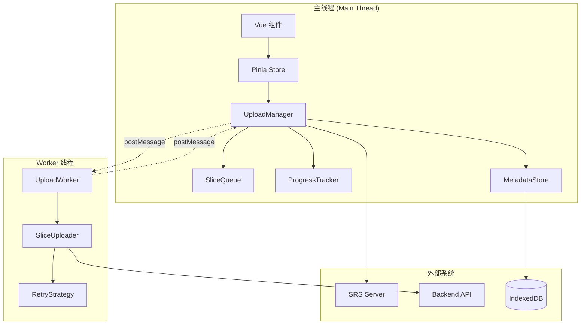

# Design Document: HLS 切片录播上传系统

## Overview

HLS 切片录播上传系统采用分层架构设计，核心思想是利用 HLS 协议天然的切片特性，避免大文件拆分，通过 WebWorker 实现后台并行上传，使用 IndexedDB 持久化上传状态以支持断点续传。

系统主要由以下几个核心模块组成：
- **上传管理器 (UploadManager)**: 协调整个上传流程
- **切片队列 (SliceQueue)**: 管理待上传切片的优先级队列
- **WebWorker 上传器 (UploadWorker)**: 在后台线程执行实际上传
- **元数据存储 (MetadataStore)**: 使用 IndexedDB 持久化上传状态
- **进度追踪器 (ProgressTracker)**: 计算和报告上传进度
- **重试策略 (RetryStrategy)**: 处理上传失败和重试逻辑

## Architecture

### 系统架构图



### 数据流

1. **初始化流程**:
   - 用户触发录播上传
   - UploadManager 从 SRS Server 获取 M3U8 索引
   - 解析 M3U8，提取切片元数据
   - 将切片信息存入 MetadataStore 和 SliceQueue

2. **上传流程**:
   - SliceQueue 按序号提供待上传切片
   - UploadManager 通过 postMessage 发送切片信息给 Worker
   - Worker 中的 SliceUploader 执行实际上传
   - 上传进度通过 postMessage 回传主线程
   - ProgressTracker 更新进度信息
   - 上传完成后更新 MetadataStore

3. **断点续传流程**:
   - 页面加载时从 MetadataStore 恢复状态
   - 过滤出未完成的切片
   - 重新加入 SliceQueue 继续上传

## Components and Interfaces

### 1. UploadManager (上传管理器)

**职责**: 协调整个上传流程，管理 Worker 生命周期

```typescript
interface UploadManager {
  // 初始化上传任务
  initializeUpload(m3u8Url: string): Promise<UploadTask>
  
  // 开始上传
  startUpload(taskId: string): void
  
  // 暂停上传
  pauseUpload(taskId: string): void
  
  // 恢复上传
  resumeUpload(taskId: string): void
  
  // 取消上传
  cancelUpload(taskId: string): void
  
  // 重试失败的切片
  retryFailedSlices(taskId: string): void
  
  // 获取上传进度
  getProgress(taskId: string): UploadProgress
}

interface UploadTask {
  id: string
  m3u8Url: string
  slices: SliceMetadata[]
  status: 'pending' | 'uploading' | 'paused' | 'completed' | 'failed'
  createdAt: number
  updatedAt: number
}
```

### 2. SliceQueue (切片队列)

**职责**: 管理待上传切片的队列，支持优先级和并发控制

```typescript
interface SliceQueue {
  // 添加切片到队列
  enqueue(slice: SliceMetadata): void
  
  // 批量添加切片
  enqueueBatch(slices: SliceMetadata[]): void
  
  // 获取下一个待上传切片
  dequeue(): SliceMetadata | null
  
  // 获取多个待上传切片（用于并行上传）
  dequeueBatch(count: number): SliceMetadata[]
  
  // 标记切片为上传中
  markAsUploading(sliceId: string): void
  
  // 标记切片为已完成
  markAsCompleted(sliceId: string): void
  
  // 标记切片为失败（重新加入队列）
  markAsFailed(sliceId: string): void
  
  // 获取队列状态
  getStatus(): QueueStatus
}

interface QueueStatus {
  pending: number
  uploading: number
  completed: number
  failed: number
  total: number
}
```

### 3. MetadataStore (元数据存储)

**职责**: 使用 IndexedDB 持久化切片元数据和上传状态

```typescript
interface MetadataStore {
  // 初始化数据库
  initialize(): Promise<void>
  
  // 保存上传任务
  saveTask(task: UploadTask): Promise<void>
  
  // 获取上传任务
  getTask(taskId: string): Promise<UploadTask | null>
  
  // 获取所有任务
  getAllTasks(): Promise<UploadTask[]>
  
  // 更新切片状态
  updateSliceStatus(taskId: string, sliceId: string, status: SliceStatus): Promise<void>
  
  // 批量更新切片状态
  updateSliceStatusBatch(updates: SliceStatusUpdate[]): Promise<void>
  
  // 删除任务
  deleteTask(taskId: string): Promise<void>
  
  // 清理已完成的任务
  cleanupCompletedTasks(olderThan: number): Promise<void>
}

interface SliceMetadata {
  id: string
  taskId: string
  index: number
  duration: number
  size: number
  localUrl: string
  remoteUrl?: string
  status: SliceStatus
  retryCount: number
  lastError?: string
  lastErrorTime?: number
}

type SliceStatus = 'pending' | 'uploading' | 'completed' | 'failed'

interface SliceStatusUpdate {
  taskId: string
  sliceId: string
  status: SliceStatus
  remoteUrl?: string
  error?: string
}
```

### 4. UploadWorker (WebWorker 上传器)

**职责**: 在后台线程执行切片上传，避免阻塞主线程

```typescript
// Worker 消息类型
type WorkerMessage = 
  | { type: 'UPLOAD_SLICE', payload: UploadSlicePayload }
  | { type: 'PAUSE_UPLOAD', payload: { taskId: string } }
  | { type: 'CANCEL_UPLOAD', payload: { taskId: string } }
  | { type: 'UPDATE_CONFIG', payload: WorkerConfig }

type WorkerResponse =
  | { type: 'UPLOAD_PROGRESS', payload: UploadProgressPayload }
  | { type: 'UPLOAD_SUCCESS', payload: UploadSuccessPayload }
  | { type: 'UPLOAD_FAILURE', payload: UploadFailurePayload }
  | { type: 'WORKER_ERROR', payload: { error: string } }

interface UploadSlicePayload {
  taskId: string
  sliceId: string
  sliceUrl: string
  uploadUrl: string
  index: number
}

interface UploadProgressPayload {
  taskId: string
  sliceId: string
  loaded: number
  total: number
  percentage: number
}

interface UploadSuccessPayload {
  taskId: string
  sliceId: string
  remoteUrl: string
  duration: number
}

interface UploadFailurePayload {
  taskId: string
  sliceId: string
  error: string
  retryable: boolean
}

interface WorkerConfig {
  maxConcurrency: number
  timeout: number
  chunkSize: number
}
```

### 5. ProgressTracker (进度追踪器)

**职责**: 计算和报告上传进度、速度和预计剩余时间

```typescript
interface ProgressTracker {
  // 初始化任务进度
  initializeTask(taskId: string, totalSize: number, totalSlices: number): void
  
  // 更新切片进度
  updateSliceProgress(taskId: string, sliceId: string, loaded: number, total: number): void
  
  // 标记切片完成
  markSliceCompleted(taskId: string, sliceId: string, size: number): void
  
  // 获取任务进度
  getTaskProgress(taskId: string): UploadProgress
  
  // 计算上传速度
  calculateSpeed(taskId: string): number
  
  // 计算预计剩余时间
  calculateETA(taskId: string): number
}

interface UploadProgress {
  taskId: string
  uploadedBytes: number
  totalBytes: number
  uploadedSlices: number
  totalSlices: number
  percentage: number
  speed: number // bytes per second
  eta: number // seconds
  sliceProgress: Map<string, SliceProgress>
}

interface SliceProgress {
  sliceId: string
  loaded: number
  total: number
  percentage: number
  status: SliceStatus
}
```

### 6. RetryStrategy (重试策略)

**职责**: 实现指数退避重试算法

```typescript
interface RetryStrategy {
  // 判断是否应该重试
  shouldRetry(retryCount: number, error: Error): boolean
  
  // 计算重试延迟（毫秒）
  calculateDelay(retryCount: number): number
  
  // 判断错误是否可重试
  isRetryableError(error: Error): boolean
}

// 指数退避实现
class ExponentialBackoffStrategy implements RetryStrategy {
  constructor(
    private maxRetries: number = 3,
    private baseDelay: number = 1000,
    private maxDelay: number = 30000
  ) {}
  
  shouldRetry(retryCount: number, error: Error): boolean {
    return retryCount < this.maxRetries && this.isRetryableError(error)
  }
  
  calculateDelay(retryCount: number): number {
    const delay = this.baseDelay * Math.pow(2, retryCount)
    return Math.min(delay, this.maxDelay)
  }
  
  isRetryableError(error: Error): boolean {
    // 网络错误、超时、5xx 服务器错误可重试
    // 4xx 客户端错误（除 408, 429）不可重试
    return true // 具体实现根据错误类型判断
  }
}
```

### 7. M3U8Parser (M3U8 解析器)

**职责**: 解析 M3U8 文件，提取切片信息

```typescript
interface M3U8Parser {
  // 解析 M3U8 文件
  parse(m3u8Content: string, baseUrl: string): M3U8Playlist
  
  // 生成 M3U8 文件
  generate(playlist: M3U8Playlist): string
}

interface M3U8Playlist {
  version: number
  targetDuration: number
  mediaSequence: number
  segments: M3U8Segment[]
  endList: boolean
}

interface M3U8Segment {
  duration: number
  uri: string
  index: number
}
```

## Data Models

### IndexedDB Schema

```typescript
// 数据库名称: hls-upload-db
// 版本: 1

// Object Store: upload_tasks
interface UploadTaskRecord {
  id: string // primary key
  m3u8Url: string
  status: 'pending' | 'uploading' | 'paused' | 'completed' | 'failed'
  totalSize: number
  uploadedSize: number
  totalSlices: number
  completedSlices: number
  createdAt: number
  updatedAt: number
  config: UploadConfig
}

// Object Store: slice_metadata
interface SliceMetadataRecord {
  id: string // primary key
  taskId: string // indexed
  index: number
  duration: number
  size: number
  localUrl: string
  remoteUrl?: string
  status: SliceStatus
  retryCount: number
  lastError?: string
  lastErrorTime?: number
  uploadedAt?: number
}

// Indexes:
// - slice_metadata.taskId
// - slice_metadata.status
// - slice_metadata.taskId + status (compound)
```

### Pinia Store

```typescript
interface UploadState {
  // 当前活动的上传任务
  activeTasks: Map<string, UploadTask>
  
  // 上传配置
  config: UploadConfig
  
  // Worker 实例
  worker: Worker | null
  
  // 进度信息
  progress: Map<string, UploadProgress>
}

interface UploadConfig {
  // 并发上传数
  maxConcurrency: number
  
  // 上传超时（毫秒）
  timeout: number
  
  // 最大重试次数
  maxRetries: number
  
  // 上传端点 URL
  uploadEndpoint: string
  
  // 是否自动开始上传
  autoStart: boolean
}
```

## Correctness Properties


*A property is a characteristic or behavior that should hold true across all valid executions of a system—essentially, a formal statement about what the system should do. Properties serve as the bridge between human-readable specifications and machine-verifiable correctness guarantees.*

### Property Reflection

After analyzing all acceptance criteria, I identified several areas where properties can be consolidated:

1. **M3U8 Round-Trip Properties**: Properties 1.2, 1.4, and 7.4 all relate to M3U8 parsing and generation. These can be combined into a comprehensive round-trip property.

2. **Metadata Persistence**: Properties 3.1, 7.1, and 7.3 all test metadata storage and retrieval. These can be consolidated into a single persistence property.

3. **Worker Message Passing**: Properties 5.2, 5.5, and 5.6 all test postMessage communication. These can be combined into a single message passing property.

4. **Progress Calculation**: Properties 6.1, 6.2, 6.3, and 6.4 all relate to progress tracking. These can be consolidated into fewer, more comprehensive properties.

5. **Queue Ordering**: Properties 2.5 and 7.5 both test ordering invariants and can be combined.

### Core Properties

**Property 1: M3U8 Round-Trip Consistency**

*For any* valid M3U8 file, parsing it to extract slice metadata, then generating a new M3U8 from that metadata should produce an equivalent playlist with the same slice order, durations, and structure.

**Validates: Requirements 1.2, 1.4, 7.4, 7.5**

---

**Property 2: M3U8 Fetch and Parse Completeness**

*For any* valid M3U8 URL, the system should successfully fetch the content and extract all slices with complete metadata (URL, index, duration, size).

**Validates: Requirements 1.1, 1.2, 7.2**

---

**Property 3: Slice-to-Index Mapping Invariant**

*For any* set of slices and their M3U8 index, the mapping relationship should remain consistent through all operations (store, retrieve, update), and no slice should be orphaned or duplicated.

**Validates: Requirements 1.3**

---

**Property 4: Concurrency Limit Invariant**

*For any* upload queue state and configured concurrency limit, the number of simultaneously uploading slices should never exceed the configured maximum.

**Validates: Requirements 2.1, 2.2**

---

**Property 5: Queue Progression Property**

*For any* upload queue with pending slices, when a slice completes and a slot becomes available, the next pending slice (in index order) should automatically begin uploading.

**Validates: Requirements 2.3, 2.5**

---

**Property 6: Metadata Persistence Round-Trip**

*For any* slice metadata (including status, URLs, retry count, errors), storing it to the Metadata_Store and then retrieving it should return equivalent data.

**Validates: Requirements 3.1, 7.1, 7.3**

---

**Property 7: State Recovery Completeness**

*For any* upload task with mixed slice states (pending, uploading, completed, failed), after simulating a page reload, the system should restore exactly the incomplete and failed slices, skipping completed ones.

**Validates: Requirements 3.2, 3.4**

---

**Property 8: Failure State Persistence**

*For any* slice that fails to upload, the system should immediately update its status to 'failed' in the Metadata_Store along with error information and timestamp.

**Validates: Requirements 3.3, 4.5**

---

**Property 9: Retry Count Limit**

*For any* slice that fails to upload, the retry count should never exceed the configured maximum (3), and after reaching the limit, the slice should be marked as permanently failed.

**Validates: Requirements 4.1, 4.3**

---

**Property 10: Exponential Backoff Calculation**

*For any* retry count n (where 0 ≤ n < maxRetries), the calculated delay should equal baseDelay × 2^n, capped at maxDelay, ensuring exponential growth.

**Validates: Requirements 4.2**

---

**Property 11: Manual Retry Availability**

*For any* slice in 'failed' status, the system should allow manual retry regardless of the current retry count, effectively resetting the retry mechanism.

**Validates: Requirements 4.4**

---

**Property 12: Worker Message Passing**

*For any* upload control action (start, pause, resume, cancel), the system should send a corresponding message to the Worker via postMessage with the correct payload structure.

**Validates: Requirements 5.2, 5.5, 5.6**

---

**Property 13: Progress Update Frequency**

*For any* active upload in the Worker, progress update messages should be sent to the main thread at regular intervals (e.g., every 100ms or 1% progress change).

**Validates: Requirements 5.3**

---

**Property 14: Total Progress Calculation**

*For any* set of slice progress values, the total upload progress should equal (sum of uploaded bytes across all slices) / (sum of total bytes across all slices) × 100.

**Validates: Requirements 6.1**

---

**Property 15: Speed and ETA Calculation**

*For any* upload session with recorded bytes transferred and time elapsed, the calculated speed should equal (bytes transferred) / (time elapsed), and ETA should equal (remaining bytes) / (current speed).

**Validates: Requirements 6.3, 6.4**

---

**Property 16: Completion Detection**

*For any* upload task, when all slices reach 'completed' status, the system should trigger the completion callback exactly once.

**Validates: Requirements 6.5**

---

**Property 17: Error Logging Completeness**

*For any* upload error (network or server), the system should log all required information: error type/status code, timestamp, affected slice ID, and error message.

**Validates: Requirements 8.1, 8.2**

---

**Property 18: Pause Behavior**

*For any* upload task in 'uploading' status, after receiving a pause command, no new slices should transition to 'uploading' status, but currently uploading slices should be allowed to complete.

**Validates: Requirements 9.2**

---

**Property 19: Resume Behavior**

*For any* paused upload task with pending slices, after receiving a resume command, pending slices should begin uploading according to the concurrency limit.

**Validates: Requirements 9.4**

---

**Property 20: Cancel and Cleanup**

*For any* upload task, after receiving a cancel command, all active uploads should be terminated, and all related data (task record, slice metadata) should be removed from the Metadata_Store.

**Validates: Requirements 9.6**

---

**Property 21: Configurable Upload Endpoint**

*For any* valid upload endpoint URL configuration, all upload requests should be sent to the configured endpoint rather than a hardcoded URL.

**Validates: Requirements 10.5**

## Error Handling

### Error Categories

1. **Network Errors**
   - Connection timeout
   - Connection refused
   - DNS resolution failure
   - Network unreachable

2. **Server Errors**
   - 5xx status codes (retryable)
   - 4xx status codes (mostly non-retryable, except 408, 429)
   - Invalid response format

3. **Client Errors**
   - Invalid M3U8 format
   - Missing slice files
   - IndexedDB quota exceeded
   - Worker initialization failure

### Error Handling Strategy

```typescript
interface ErrorHandler {
  // 处理上传错误
  handleUploadError(error: UploadError): ErrorHandlingDecision
  
  // 处理 Worker 错误
  handleWorkerError(error: WorkerError): void
  
  // 处理存储错误
  handleStorageError(error: StorageError): void
}

interface UploadError {
  type: 'network' | 'server' | 'client'
  sliceId: string
  statusCode?: number
  message: string
  timestamp: number
  retryable: boolean
}

interface ErrorHandlingDecision {
  shouldRetry: boolean
  retryDelay?: number
  fallbackAction?: 'skip' | 'manual' | 'abort'
}
```

### Error Recovery

- **Network Errors**: Automatic retry with exponential backoff
- **Server 5xx Errors**: Automatic retry with exponential backoff
- **Server 4xx Errors**: Mark as failed, require manual intervention
- **Client Errors**: Log error, mark slice as failed, continue with other slices
- **Storage Errors**: Attempt to free space, fallback to memory-only mode

## Testing Strategy

### Dual Testing Approach

本系统采用单元测试和基于属性的测试（Property-Based Testing, PBT）相结合的策略：

- **单元测试**: 验证特定示例、边缘情况和错误条件
- **属性测试**: 验证跨所有输入的通用属性

两者互补，共同确保全面覆盖：单元测试捕获具体的 bug，属性测试验证通用正确性。

### Property-Based Testing Configuration

**测试库选择**: 使用 `fast-check` 库（TypeScript/JavaScript 的 PBT 库）

**测试配置**:
- 每个属性测试最少运行 100 次迭代（由于随机化）
- 每个测试必须引用其设计文档中的属性
- 标签格式: `Feature: hls-recording-upload, Property {number}: {property_text}`

**测试覆盖**:
- 每个 Correctness Property 必须由单个属性测试实现
- 单元测试专注于：
  - 具体示例（如特定的 M3U8 格式）
  - 边缘情况（空队列、单个切片、网络超时）
  - 错误条件（无效 URL、存储失败）
  - 组件集成点

### Test Organization

```
tests/
├── unit/
│   ├── m3u8-parser.test.ts
│   ├── slice-queue.test.ts
│   ├── metadata-store.test.ts
│   ├── progress-tracker.test.ts
│   └── retry-strategy.test.ts
├── property/
│   ├── m3u8-roundtrip.property.test.ts
│   ├── queue-concurrency.property.test.ts
│   ├── metadata-persistence.property.test.ts
│   ├── retry-logic.property.test.ts
│   └── progress-calculation.property.test.ts
├── integration/
│   ├── upload-flow.test.ts
│   └── worker-communication.test.ts
└── fixtures/
    ├── sample-m3u8/
    └── mock-slices/
```

### Example Property Test

```typescript
// Feature: hls-recording-upload, Property 1: M3U8 Round-Trip Consistency
import fc from 'fast-check'

describe('M3U8 Round-Trip Consistency', () => {
  it('should preserve playlist structure through parse-generate cycle', () => {
    fc.assert(
      fc.property(
        fc.record({
          version: fc.integer({ min: 1, max: 7 }),
          targetDuration: fc.integer({ min: 1, max: 60 }),
          segments: fc.array(
            fc.record({
              duration: fc.float({ min: 0.1, max: 60 }),
              uri: fc.webUrl(),
              index: fc.integer({ min: 0 })
            }),
            { minLength: 1, maxLength: 100 }
          )
        }),
        (playlist) => {
          const m3u8Content = M3U8Parser.generate(playlist)
          const parsed = M3U8Parser.parse(m3u8Content, 'http://example.com')
          
          expect(parsed.version).toBe(playlist.version)
          expect(parsed.targetDuration).toBe(playlist.targetDuration)
          expect(parsed.segments).toHaveLength(playlist.segments.length)
          
          parsed.segments.forEach((seg, idx) => {
            expect(seg.duration).toBeCloseTo(playlist.segments[idx].duration, 3)
            expect(seg.index).toBe(playlist.segments[idx].index)
          })
        }
      ),
      { numRuns: 100 }
    )
  })
})
```

### Unit Test Balance

- 避免编写过多的单元测试 - 属性测试已经处理了大量输入覆盖
- 单元测试应专注于：
  - 演示正确行为的具体示例
  - 组件之间的集成点
  - 边缘情况和错误条件
- 属性测试应专注于：
  - 对所有输入都成立的通用属性
  - 通过随机化实现全面的输入覆盖

### Mock Strategy

- **SRS Server**: Mock HTTP responses for M3U8 and slice files
- **Backend API**: Mock upload endpoints with configurable success/failure rates
- **IndexedDB**: Use fake-indexeddb for testing
- **WebWorker**: Use worker-loader with mock implementations
- **Network Conditions**: Simulate various network speeds and failures

### Integration Testing

- Test complete upload flow from M3U8 fetch to completion
- Test Worker communication and lifecycle
- Test state persistence and recovery across page reloads
- Test concurrent uploads with various queue configurations
- Test error scenarios and recovery mechanisms
