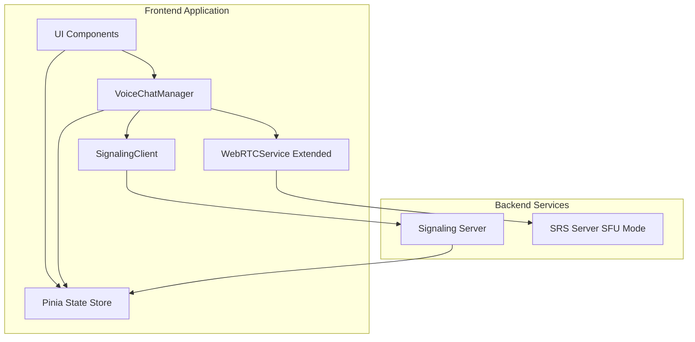

# Design Document: WebRTC 连麦功能

## Overview

本设计文档描述了基于 SRS-SFU 架构的 WebRTC 连麦功能的技术实现方案。系统采用分层架构，包括信令层、WebRTC 连接层、状态管理层和 UI 层。核心设计理念是：

- **SFU 架构**: 使用 SRS 服务器作为 SFU，负责流的选择性转发，降低客户端带宽压力
- **N-to-N 通信**: 每个参与者既是 Publisher 也是 Subscriber，实现全双工通信
- **状态驱动**: 使用 Pinia 进行集中式状态管理，确保 UI 与连接状态同步
- **渐进增强**: 扩展现有 WebRTCService，保持向后兼容
- **容错设计**: 完善的错误处理和自动重连机制

## Architecture

### 系统架构图



### 架构层次

1. **UI Layer (UI 层)**
   - VoiceChatPanel: 连麦控制面板
   - ParticipantGrid: 参与者视频网格
   - RequestList: 连麦请求列表（主播端）
   - ControlButtons: 音视频控制按钮

2. **State Management Layer (状态管理层)**
   - useVoiceChatStore: Pinia store，管理连麦状态
   - 状态包括：连接状态、参与者列表、请求队列、音视频状态

3. **Business Logic Layer (业务逻辑层)**
   - VoiceChatManager: 连麦管理器，协调各组件
   - 处理连麦流程：申请、接受、拒绝、挂断

4. **WebRTC Layer (WebRTC 层)**
   - WebRTCService (扩展): 封装 WebRTC API
   - PeerConnectionManager: 管理多个 RTCPeerConnection
   - MediaStreamManager: 管理本地和远程媒体流

5. **Signaling Layer (信令层)**
   - SignalingClient: 信令客户端
   - 支持 WebSocket 和 HTTP 轮询
   - 处理 SDP 和 ICE 候选交换

## Components and Interfaces

### 1. VoiceChatManager

连麦管理器，协调整个连麦流程。

```typescript
interface VoiceChatManager {
  // 初始化
  initialize(userId: string, role: 'host' | 'audience'): Promise<void>
  
  // 连麦申请（观众端）
  requestJoin(): Promise<void>
  
  // 接受连麦（主播端）
  acceptRequest(requestId: string): Promise<void>
  
  // 拒绝连麦（主播端）
  rejectRequest(requestId: string): Promise<void>
  
  // 挂断连麦
  hangup(): Promise<void>
  
  // 控制音视频
  toggleAudio(enabled: boolean): Promise<void>
  toggleVideo(enabled: boolean): Promise<void>
  
  // 获取参与者列表
  getParticipants(): Participant[]
  
  // 事件监听
  on(event: VoiceChatEvent, handler: EventHandler): void
  off(event: VoiceChatEvent, handler: EventHandler): void
}

interface Participant {
  id: string
  name: string
  role: 'host' | 'audience'
  audioEnabled: boolean
  videoEnabled: boolean
  connectionState: RTCPeerConnectionState
  networkQuality: NetworkQuality
}

type VoiceChatEvent = 
  | 'request-received'
  | 'request-accepted'
  | 'request-rejected'
  | 'participant-joined'
  | 'participant-left'
  | 'connection-state-changed'
  | 'network-quality-changed'
  | 'error'

interface NetworkQuality {
  level: 'excellent' | 'good' | 'fair' | 'poor'
  packetLoss: number
  jitter: number
  rtt: number
}
```

### 2. WebRTCService (扩展)

扩展现有的 WebRTCService 类，添加连麦功能。

```typescript
interface WebRTCServiceExtended extends WebRTCService {
  // 创建 Peer Connection
  createPeerConnection(
    participantId: string,
    config: RTCConfiguration
  ): RTCPeerConnection
  
  // 添加本地流
  addLocalStream(
    pc: RTCPeerConnection,
    stream: MediaStream
  ): void
  
  // 创建 Offer
  createOffer(pc: RTCPeerConnection): Promise<RTCSessionDescriptionInit>
  
  // 创建 Answer
  createAnswer(pc: RTCPeerConnection): Promise<RTCSessionDescriptionInit>
  
  // 设置远程描述
  setRemoteDescription(
    pc: RTCPeerConnection,
    sdp: RTCSessionDescriptionInit
  ): Promise<void>
  
  // 添加 ICE 候选
  addIceCandidate(
    pc: RTCPeerConnection,
    candidate: RTCIceCandidateInit
  ): Promise<void>
  
  // 获取本地媒体流
  getLocalMediaStream(constraints: MediaStreamConstraints): Promise<MediaStream>
  
  // 关闭连接
  closePeerConnection(pc: RTCPeerConnection): void
  
  // 获取连接统计
  getConnectionStats(pc: RTCPeerConnection): Promise<RTCStatsReport>
}
```

### 3. PeerConnectionManager

管理多个 RTCPeerConnection 实例。

```typescript
interface PeerConnectionManager {
  // 创建连接
  createConnection(participantId: string): RTCPeerConnection
  
  // 获取连接
  getConnection(participantId: string): RTCPeerConnection | undefined
  
  // 移除连接
  removeConnection(participantId: string): void
  
  // 获取所有连接
  getAllConnections(): Map<string, RTCPeerConnection>
  
  // 关闭所有连接
  closeAllConnections(): void
  
  // 监控连接状态
  monitorConnectionState(
    participantId: string,
    callback: (state: RTCPeerConnectionState) => void
  ): void
  
  // 监控网络质量
  monitorNetworkQuality(
    participantId: string,
    callback: (quality: NetworkQuality) => void
  ): void
}
```

### 4. SignalingClient

信令客户端，处理信令消息的发送和接收。

```typescript
interface SignalingClient {
  // 连接信令服务器
  connect(url: string, token: string): Promise<void>
  
  // 断开连接
  disconnect(): void
  
  // 发送连麦请求
  sendJoinRequest(hostId: string): Promise<void>
  
  // 发送 SDP Offer
  sendOffer(targetId: string, sdp: RTCSessionDescriptionInit): Promise<void>
  
  // 发送 SDP Answer
  sendAnswer(targetId: string, sdp: RTCSessionDescriptionInit): Promise<void>
  
  // 发送 ICE 候选
  sendIceCandidate(targetId: string, candidate: RTCIceCandidateInit): Promise<void>
  
  // 发送挂断信号
  sendHangup(targetId: string): Promise<void>
  
  // 事件监听
  on(event: SignalingEvent, handler: SignalingEventHandler): void
  off(event: SignalingEvent, handler: SignalingEventHandler): void
}

type SignalingEvent =
  | 'connected'
  | 'disconnected'
  | 'join-request'
  | 'offer'
  | 'answer'
  | 'ice-candidate'
  | 'hangup'
  | 'error'

interface SignalingMessage {
  type: SignalingEvent
  from: string
  to: string
  data: any
  timestamp: number
}
```

### 5. Pinia State Store

```typescript
interface VoiceChatState {
  // 当前用户信息
  currentUser: {
    id: string
    role: 'host' | 'audience'
    audioEnabled: boolean
    videoEnabled: boolean
  }
  
  // 连接状态
  connectionState: 'idle' | 'requesting' | 'connecting' | 'connected' | 'disconnecting'
  
  // 参与者列表
  participants: Map<string, Participant>
  
  // 连麦请求队列（主播端）
  requestQueue: JoinRequest[]
  
  // 本地媒体流
  localStream: MediaStream | null
  
  // 远程媒体流
  remoteStreams: Map<string, MediaStream>
  
  // 错误信息
  error: Error | null
}

interface JoinRequest {
  id: string
  userId: string
  userName: string
  timestamp: number
  status: 'pending' | 'accepted' | 'rejected' | 'expired'
}

interface VoiceChatActions {
  // 设置当前用户
  setCurrentUser(user: VoiceChatState['currentUser']): void
  
  // 更新连接状态
  updateConnectionState(state: VoiceChatState['connectionState']): void
  
  // 添加参与者
  addParticipant(participant: Participant): void
  
  // 移除参与者
  removeParticipant(participantId: string): void
  
  // 更新参与者
  updateParticipant(participantId: string, updates: Partial<Participant>): void
  
  // 添加连麦请求
  addJoinRequest(request: JoinRequest): void
  
  // 移除连麦请求
  removeJoinRequest(requestId: string): void
  
  // 更新请求状态
  updateRequestStatus(requestId: string, status: JoinRequest['status']): void
  
  // 设置本地流
  setLocalStream(stream: MediaStream): void
  
  // 添加远程流
  addRemoteStream(participantId: string, stream: MediaStream): void
  
  // 移除远程流
  removeRemoteStream(participantId: string): void
  
  // 设置错误
  setError(error: Error): void
  
  // 清除错误
  clearError(): void
  
  // 重置状态
  reset(): void
}
```

## Data Models

### WebRTC Configuration

```typescript
interface WebRTCConfig {
  iceServers: RTCIceServer[]
  iceTransportPolicy: RTCIceTransportPolicy
  bundlePolicy: RTCBundlePolicy
  rtcpMuxPolicy: RTCRtcpMuxPolicy
}

const defaultWebRTCConfig: WebRTCConfig = {
  iceServers: [
    { urls: 'stun:stun.l.google.com:19302' },
    { urls: 'stun:stun1.l.google.com:19302' }
  ],
  iceTransportPolicy: 'all',
  bundlePolicy: 'max-bundle',
  rtcpMuxPolicy: 'require'
}
```

### Media Constraints

```typescript
interface MediaConstraints {
  audio: AudioConstraints
  video: VideoConstraints | false
}

interface AudioConstraints {
  echoCancellation: boolean
  noiseSuppression: boolean
  autoGainControl: boolean
  sampleRate: number
  channelCount: number
}

interface VideoConstraints {
  width: { min: number; ideal: number; max: number }
  height: { min: number; ideal: number; max: number }
  frameRate: { min: number; ideal: number; max: number }
  facingMode: 'user' | 'environment'
}

const defaultMediaConstraints: MediaConstraints = {
  audio: {
    echoCancellation: true,
    noiseSuppression: true,
    autoGainControl: true,
    sampleRate: 48000,
    channelCount: 1
  },
  video: {
    width: { min: 320, ideal: 640, max: 1280 },
    height: { min: 240, ideal: 480, max: 720 },
    frameRate: { min: 15, ideal: 24, max: 30 },
    facingMode: 'user'
  }
}
```

### Connection Flow State Machine

```typescript
type ConnectionFlowState =
  | 'idle'           // 空闲状态
  | 'requesting'     // 发送连麦请求
  | 'waiting'        // 等待主播审批
  | 'offering'       // 创建并发送 Offer
  | 'answering'      // 创建并发送 Answer
  | 'connecting'     // ICE 连接中
  | 'connected'      // 已连接
  | 'disconnecting'  // 断开连接中
  | 'failed'         // 连接失败
  | 'closed'         // 连接已关闭

interface ConnectionFlowTransition {
  from: ConnectionFlowState
  to: ConnectionFlowState
  trigger: string
  action?: () => void
}
```

### SRS API Integration

```typescript
interface SRSApiClient {
  baseUrl: string
  
  // 发布流
  publish(params: PublishParams): Promise<PublishResponse>
  
  // 播放流
  play(params: PlayParams): Promise<PlayResponse>
  
  // 停止发布
  unpublish(streamId: string): Promise<void>
  
  // 停止播放
  stop(streamId: string): Promise<void>
}

interface PublishParams {
  app: string
  stream: string
  sdp: string
}

interface PublishResponse {
  code: number
  server: string
  sessionid: string
  sdp: string
}

interface PlayParams {
  app: string
  stream: string
  sdp: string
}

interface PlayResponse {
  code: number
  server: string
  sessionid: string
  sdp: string
}
```

## Correctness Properties


*属性是一个特征或行为，应该在系统的所有有效执行中保持为真——本质上是关于系统应该做什么的形式化陈述。属性作为人类可读规范和机器可验证正确性保证之间的桥梁。*

### Property Reflection

在分析了所有验收标准后，我识别出以下冗余情况：
- 属性 2.3 和 4.3 都测试"接受请求触发 WebRTC 连接"，可以合并
- 属性 2.5 和 4.4 都测试"拒绝请求的通知和队列清理"，可以合并
- 属性 7.7 和 9.6 都测试"最多 6 人连接限制"，可以合并
- 多个属性测试音视频轨道控制（5.1-5.4），可以合并为一个综合属性
- 多个属性测试 UI 状态显示（7.4, 7.6），可以合并

经过去重后，我将编写以下核心属性：

### Core Properties

**Property 1: WebRTC Connection Establishment**
*For any* participant initiating publishing, the system should successfully establish a WebRTC connection to SRS server and obtain a unique stream identifier.
**Validates: Requirements 1.1, 1.2**

**Property 2: Stream Subscription**
*For any* valid stream identifier, when a participant subscribes to that stream, the system should request it from SRS server using the correct identifier.
**Validates: Requirements 1.3**

**Property 3: Simultaneous Publish and Subscribe**
*For any* participant in a voice chat session, they should be able to both publish their own stream and subscribe to other participants' streams simultaneously.
**Validates: Requirements 1.4**

**Property 4: Join Request Delivery**
*For any* audience member requesting to join, the system should send a connection request through the signaling channel to the host, and the request should appear in the host's request queue.
**Validates: Requirements 2.1, 2.2**

**Property 5: Request Acceptance Flow**
*For any* pending join request, when the host accepts it, the system should initiate SDP offer/answer exchange followed by ICE candidate exchange.
**Validates: Requirements 2.3, 2.4, 4.3**

**Property 6: Request Rejection Flow**
*For any* pending join request, when the host rejects it, the system should notify the requester, remove the request from the queue, and not establish any connection.
**Validates: Requirements 2.5, 4.4**

**Property 7: Disconnection Cleanup**
*For any* active connection, when either party initiates disconnection, the system should send a hangup signal, close the WebRTC connection, update participant lists, and clean up all associated resources.
**Validates: Requirements 2.6, 10.1**

**Property 8: ICE Candidate Timing**
*For any* gathered ICE candidate, the system should send it through the signaling channel within 5 seconds of gathering.
**Validates: Requirements 2.8**

**Property 9: State Atomicity**
*For any* state transition in the state store, the update should be atomic and emit a change event that reflects the new state.
**Validates: Requirements 3.2**

**Property 10: Participant List Consistency**
*For any* join or leave event, the participant list in the state store should be updated immediately and accurately reflect all currently connected participants.
**Validates: Requirements 3.3, 3.4**

**Property 11: Audio/Video Status Tracking**
*For any* participant, the state store should accurately track their audio and video enabled/disabled status, and updates should occur within 100ms of track state changes.
**Validates: Requirements 3.5, 5.6**

**Property 12: State Persistence Round Trip**
*For any* critical state information (connection state, participant list, audio/video status), persisting to storage and then restoring should produce equivalent state.
**Validates: Requirements 3.7**

**Property 13: Request Timeout**
*For any* join request that remains unprocessed, the system should automatically expire it after 30 seconds and notify the requester.
**Validates: Requirements 4.5**

**Property 14: Duplicate Request Prevention**
*For any* audience member with a pending request, attempting to send another request should be rejected until the first request is processed or expired.
**Validates: Requirements 4.6**

**Property 15: Request Queue Cleanup**
*For any* join request, when the connection is successfully established, the request should be removed from the request queue.
**Validates: Requirements 4.7**

**Property 16: Media Track Control**
*For any* participant, enabling/disabling audio or video should add/remove the corresponding track from the published stream, notify other participants, and allow independent control of audio and video.
**Validates: Requirements 5.1, 5.2, 5.3, 5.4, 5.5**

**Property 17: Permission Denial Handling**
*For any* media device permission denial, the system should handle it gracefully, notify the user with a clear message, and not crash or enter an invalid state.
**Validates: Requirements 5.7, 8.4**

**Property 18: Audio Processing Configuration**
*For any* audio capture, the system should enable echo cancellation, noise suppression, and automatic gain control by default in the media constraints.
**Validates: Requirements 6.1, 6.2, 6.3**

**Property 19: Connection Limit Enforcement**
*For any* voice chat session, when 6 participants are already connected, attempting to add a 7th participant should be rejected with an appropriate error message.
**Validates: Requirements 7.7, 9.6**

**Property 20: UI Participant Display**
*For any* participant in the voice chat, the UI should display their video feed, name, audio/video status icons, and network quality indicator in the grid layout.
**Validates: Requirements 7.1, 7.4, 7.6**

**Property 21: Layout Adaptation**
*For any* number of participants from 1 to 6, the UI layout should adapt appropriately to display all participants clearly.
**Validates: Requirements 7.2**

**Property 22: Active Speaker Highlighting**
*For any* participant who is currently speaking, the UI should highlight their video feed with a visual indicator.
**Validates: Requirements 7.3**

**Property 23: Network Quality Warning**
*For any* participant with poor network quality (packet loss > 10% or RTT > 300ms), the UI should display a warning indicator.
**Validates: Requirements 7.5**

**Property 24: Connection Retry Logic**
*For any* WebRTC connection that fails to establish within 10 seconds, the system should retry up to 3 times with exponential backoff before giving up.
**Validates: Requirements 8.1**

**Property 25: Retry Exhaustion Notification**
*For any* connection where all 3 retry attempts have failed, the system should notify the user with a descriptive error message.
**Validates: Requirements 8.2**

**Property 26: Network Interruption Recovery**
*For any* detected network interruption during an active connection, the system should attempt to re-establish the connection automatically.
**Validates: Requirements 8.3**

**Property 27: Error Logging**
*For any* ICE connection failure or audio quality issue, the system should log diagnostic information including error type, timestamp, and connection statistics.
**Validates: Requirements 6.5, 8.5**

**Property 28: Server Unreachable Handling**
*For any* attempt to connect when SRS server is unreachable, the system should display a server error message and prevent further connection attempts until the server is available.
**Validates: Requirements 8.6**

**Property 29: Connection Loss Notification**
*For any* connection lost during voice chat, the system should notify all affected participants and update their connection status to disconnected.
**Validates: Requirements 8.7**

**Property 30: Adaptive Video Resolution**
*For any* connection experiencing limited bandwidth (< 500 kbps), the system should reduce video resolution to maintain connection stability.
**Validates: Requirements 9.1**

**Property 31: Audio Priority**
*For any* connection where network quality degrades, the system should prioritize audio quality over video quality, reducing video bitrate before affecting audio.
**Validates: Requirements 9.2**

**Property 32: Network Statistics Monitoring**
*For any* active connection, the system should collect network statistics (packet loss, jitter, RTT) every 2 seconds.
**Validates: Requirements 9.3**

**Property 33: Bitrate Adjustment**
*For any* connection where packet loss exceeds 10%, the system should reduce video bitrate by 25%.
**Validates: Requirements 9.4**

**Property 34: Quality Recovery**
*For any* connection where network quality improves (packet loss < 5% for 10 seconds), the system should gradually increase video quality up to the maximum supported resolution.
**Validates: Requirements 9.5**

**Property 35: Host Session Termination**
*For any* voice chat session, when the host ends the session, the system should disconnect all participants and close all connections.
**Validates: Requirements 10.2**

**Property 36: Control Responsiveness**
*For any* mute/unmute or camera toggle operation, the UI should respond within 100ms.
**Validates: Requirements 10.3, 10.4**

**Property 37: Forced Disconnection Notification**
*For any* participant disconnected by the host, the system should notify them with the reason for disconnection.
**Validates: Requirements 10.5**

**Property 38: Remote Mute Control**
*For any* participant, the host should be able to remotely mute their audio, and the change should be reflected in the participant's state.
**Validates: Requirements 10.6**

**Property 39: Control Operation Failure Handling**
*For any* control operation (mute, unmute, camera toggle) that fails, the system should display an error message and maintain the previous state without partial updates.
**Validates: Requirements 10.7**

**Property 40: Backward Compatibility**
*For any* existing push/pull stream functionality, it should continue to work correctly after extending WebRTC_Service with voice chat capabilities.
**Validates: Requirements 11.2**

**Property 41: Connection State Events**
*For any* connection state change (connecting, connected, disconnected, failed), the WebRTC_Service should emit an event that can be consumed by UI components.
**Validates: Requirements 11.6**

**Property 42: Signaling Message Support**
*For any* signaling message type (join request, SDP offer/answer, ICE candidate, hangup), the signaling channel should support sending and receiving it.
**Validates: Requirements 12.1**

**Property 43: Message Delivery Latency**
*For any* signaling message sent under normal network conditions, it should be delivered within 500ms.
**Validates: Requirements 12.2**

**Property 44: WebSocket Fallback**
*For any* signaling channel initialization, if WebSocket is unavailable, the system should automatically fall back to HTTP polling with 1-second intervals.
**Validates: Requirements 12.4**

**Property 45: Message Authentication**
*For any* signaling message sent or received, it should include authentication information to prevent unauthorized access.
**Validates: Requirements 12.5**

**Property 46: Message Ordering**
*For any* connection establishment, SDP offer/answer exchange should complete before ICE candidate exchange begins.
**Validates: Requirements 12.6**

**Property 47: Message Delivery Retry**
*For any* signaling message that fails to deliver, the system should retry up to 3 times before reporting failure.
**Validates: Requirements 12.7**

## Error Handling

### Error Categories

1. **Connection Errors**
   - WebRTC connection establishment failure
   - ICE connection failure
   - SRS server unreachable
   - Network interruption

2. **Permission Errors**
   - Microphone permission denied
   - Camera permission denied
   - Media device not found

3. **Signaling Errors**
   - Signaling channel disconnection
   - Message delivery failure
   - Invalid message format
   - Authentication failure

4. **State Errors**
   - Invalid state transition
   - Duplicate request
   - Request timeout
   - Connection limit exceeded

5. **Media Errors**
   - Track addition failure
   - Track removal failure
   - Stream capture failure
   - Codec negotiation failure

### Error Handling Strategy

```typescript
interface ErrorHandler {
  // 处理错误
  handleError(error: VoiceChatError): void
  
  // 错误恢复
  attemptRecovery(error: VoiceChatError): Promise<boolean>
  
  // 用户通知
  notifyUser(error: VoiceChatError): void
  
  // 错误日志
  logError(error: VoiceChatError): void
}

interface VoiceChatError {
  code: string
  message: string
  category: ErrorCategory
  severity: 'low' | 'medium' | 'high' | 'critical'
  recoverable: boolean
  context: Record<string, any>
  timestamp: number
}

type ErrorCategory = 
  | 'connection'
  | 'permission'
  | 'signaling'
  | 'state'
  | 'media'
```

### Retry Strategy

```typescript
interface RetryConfig {
  maxAttempts: number
  initialDelay: number
  maxDelay: number
  backoffMultiplier: number
}

const defaultRetryConfig: RetryConfig = {
  maxAttempts: 3,
  initialDelay: 1000,      // 1 second
  maxDelay: 10000,         // 10 seconds
  backoffMultiplier: 2
}

// 指数退避算法
function calculateDelay(attempt: number, config: RetryConfig): number {
  const delay = config.initialDelay * Math.pow(config.backoffMultiplier, attempt - 1)
  return Math.min(delay, config.maxDelay)
}
```

### Error Recovery Flows

1. **Connection Failure Recovery**
   ```
   Connection Failed
   → Check network connectivity
   → Retry with exponential backoff (3 attempts)
   → If all retries fail, notify user
   → Allow manual retry
   ```

2. **Network Interruption Recovery**
   ```
   Network Interruption Detected
   → Pause media transmission
   → Monitor network status
   → When network recovers, attempt reconnection
   → If reconnection fails, follow connection failure recovery
   ```

3. **Permission Denial Recovery**
   ```
   Permission Denied
   → Display clear instructions to user
   → Provide link to browser settings
   → Allow retry after user grants permission
   → Degrade gracefully (audio-only if camera denied)
   ```

4. **Signaling Failure Recovery**
   ```
   Signaling Message Failed
   → Retry message delivery (3 attempts)
   → If WebSocket fails, fall back to HTTP polling
   → If all attempts fail, close connection gracefully
   → Notify user of signaling issues
   ```

## Testing Strategy

### Dual Testing Approach

本项目采用单元测试和基于属性的测试（Property-Based Testing, PBT）相结合的策略：

- **单元测试**: 验证特定示例、边缘情况和错误条件
- **属性测试**: 验证所有输入下的通用属性
- 两者互补，共同确保全面覆盖

### Unit Testing Focus

单元测试应专注于：
- 特定示例，展示正确行为
- 组件之间的集成点
- 边缘情况和错误条件
- UI 交互和用户流程

避免编写过多单元测试 - 属性测试已经处理了大量输入覆盖。

### Property-Based Testing

**测试库选择**: 使用 `fast-check` (TypeScript/JavaScript 的 PBT 库)

**配置要求**:
- 每个属性测试最少运行 100 次迭代
- 每个测试必须引用设计文档中的属性
- 标签格式: `Feature: webrtc-voice-chat, Property {number}: {property_text}`

**示例属性测试**:

```typescript
import fc from 'fast-check'
import { describe, it, expect } from 'vitest'

describe('WebRTC Voice Chat Properties', () => {
  // Feature: webrtc-voice-chat, Property 3: Simultaneous Publish and Subscribe
  it('should allow any participant to publish and subscribe simultaneously', () => {
    fc.assert(
      fc.property(
        fc.record({
          participantId: fc.uuid(),
          hasAudio: fc.boolean(),
          hasVideo: fc.boolean()
        }),
        async (participant) => {
          const manager = new VoiceChatManager()
          await manager.initialize(participant.participantId, 'audience')
          
          // Start publishing
          const publishStream = await manager.startPublishing({
            audio: participant.hasAudio,
            video: participant.hasVideo
          })
          
          // Subscribe to another stream
          const subscribeStream = await manager.subscribe('other-participant-id')
          
          // Both should succeed
          expect(publishStream).toBeDefined()
          expect(subscribeStream).toBeDefined()
          expect(manager.isPublishing()).toBe(true)
          expect(manager.isSubscribing()).toBe(true)
        }
      ),
      { numRuns: 100 }
    )
  })
  
  // Feature: webrtc-voice-chat, Property 12: State Persistence Round Trip
  it('should preserve state after persist and restore', () => {
    fc.assert(
      fc.property(
        fc.record({
          connectionState: fc.constantFrom('idle', 'requesting', 'connecting', 'connected'),
          participants: fc.array(fc.record({
            id: fc.uuid(),
            name: fc.string(),
            audioEnabled: fc.boolean(),
            videoEnabled: fc.boolean()
          }), { maxLength: 6 })
        }),
        (state) => {
          const store = useVoiceChatStore()
          
          // Set state
          store.updateConnectionState(state.connectionState)
          state.participants.forEach(p => store.addParticipant(p))
          
          // Persist
          const persisted = store.persist()
          
          // Reset
          store.reset()
          
          // Restore
          store.restore(persisted)
          
          // Verify equivalence
          expect(store.connectionState).toBe(state.connectionState)
          expect(store.participants.size).toBe(state.participants.length)
          state.participants.forEach(p => {
            const restored = store.participants.get(p.id)
            expect(restored).toEqual(p)
          })
        }
      ),
      { numRuns: 100 }
    )
  })
  
  // Feature: webrtc-voice-chat, Property 14: Duplicate Request Prevention
  it('should prevent duplicate requests from the same user', () => {
    fc.assert(
      fc.property(
        fc.uuid(),
        async (userId) => {
          const manager = new VoiceChatManager()
          await manager.initialize(userId, 'audience')
          
          // Send first request
          await manager.requestJoin()
          const store = useVoiceChatStore()
          const firstRequestCount = store.requestQueue.length
          
          // Attempt duplicate request
          const duplicateResult = await manager.requestJoin()
          const secondRequestCount = store.requestQueue.length
          
          // Should be rejected
          expect(duplicateResult.success).toBe(false)
          expect(secondRequestCount).toBe(firstRequestCount)
        }
      ),
      { numRuns: 100 }
    )
  })
})
```

### Integration Testing

集成测试应覆盖：
- 完整的连麦流程（申请 → 接受 → 连接 → 挂断）
- 信令服务器与 WebRTC 服务的集成
- SRS 服务器 API 调用
- 状态管理与 UI 组件的集成

### End-to-End Testing

E2E 测试应覆盖：
- 用户完整的连麦体验
- 多人连麦场景
- 网络中断和恢复
- 错误处理和用户通知

### Test Coverage Goals

- 单元测试覆盖率: > 80%
- 属性测试: 所有 47 个属性都有对应测试
- 集成测试: 覆盖所有主要流程
- E2E 测试: 覆盖所有用户场景

### Testing Tools

- **Unit Testing**: Vitest
- **Property-Based Testing**: fast-check
- **E2E Testing**: Playwright 或 Cypress
- **Mocking**: vitest/mock
- **Coverage**: vitest coverage (c8)
